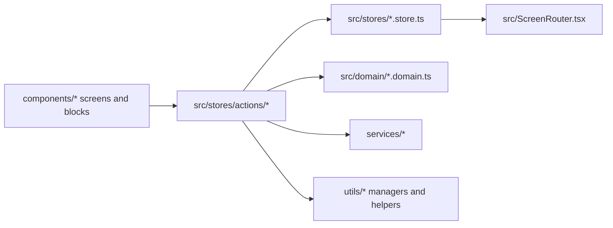

# DEVELOPMENT_with_ai.md - Architectural Guide for AI Agents

This document is the architecture decision source of truth for AI agents working in this repository.
Use it to decide where to add code, how to keep boundaries clean, and how to avoid regressions.
If a task conflicts with this guide, prefer this guide unless a developer explicitly overrides it.

## 1) Project Identity

- Product: Telegram Mini App for mental health support (Menhausen).
- Platform: Telegram WebView first (iOS/Android), mobile-first UX (target width 393px).
- Stack: React 18 + TypeScript, Vite 7, Tailwind CSS 4, Nanostores, Supabase, PostHog.
- Languages: Russian and English.

## 2) Critical File Map

| Concern | Main files |
|---|---|
| App entry | `main.tsx` -> `App.tsx` -> `AppContent.tsx` |
| Routing and screen rendering | `src/ScreenRouter.tsx`, `src/screen-routes/*.routes.tsx` |
| Global state | `src/stores/*.store.ts` |
| Side-effect actions | `src/stores/actions/*.actions.ts` |
| Pure business logic | `src/domain/*.domain.ts` |
| UI screens and blocks | `components/` |
| UI primitives | `components/ui/` |
| Types | `types/*.ts` |
| Content and localization data | `data/content/{ru,en}/*.json` |
| Content loading | `utils/contentLoader.ts`, `utils/ThemeLoader.ts` |
| Persistence managers | `utils/dataManager.ts`, `utils/PointsManager.ts`, `utils/DailyCheckinManager.ts`, `utils/ThemeCardManager.ts` |
| Sync layer | `utils/supabaseSync/*` |
| Backend edge functions | `supabase/functions/*` |
| DB schema and migrations | `supabase/migrations/*` |
| Tests | `tests/unit/*`, `tests/e2e/*` |
| Design tokens and global CSS | `styles/globals.css` |
| UX/dev standards | `guidelines/Guidelines.md` |

## 3) Architecture Layers and Boundaries

Layer rules:

1. `src/domain/*` is pure logic only.
2. `src/stores/*` owns app-global state atoms/maps/computed values.
3. `src/stores/actions/*` orchestrates flows: navigation + state updates + side effects.
4. `services/*` is persistence/business services (achievements, user stats, display helpers).
5. `utils/*` contains reusable infra/managers (content loading, storage managers, sync helpers).
6. `components/*` should remain view-focused and call handlers/actions, not own cross-feature orchestration.

## 4) State Management Rules (Nanostores First)

- Primary global state mechanism: Nanostores (`atom`, `map`, `computed`).
- Access pattern in React components: `useStore($store)`.
- Current navigation state: `src/stores/navigation.store.ts` (`$currentScreen`, history, direction).
- Screen payload context: `src/stores/screen-params.store.ts` (`$screenParams` map).
- Content and language state are centralized and reused across screens.

Hard constraints:

- Do not introduce new React Context for global app state if Nanostore can solve it.
- Do not place business logic in components when it can be pure domain logic.
- Domain files must not import stores.

## 5) Navigation System Rules

- Single source of active screen is `$currentScreen`.
- Rendering is centralized in `src/ScreenRouter.tsx`.
- Feature-level route mapping is split by modules in `src/screen-routes/*.routes.tsx`.
- Back/forward behavior uses store-managed history, not ad-hoc component state.

When adding a new screen:

1. Add/extend screen typing in `types/userState.ts` (`AppScreen` union).
2. Create screen component in `components/`.
3. Register rendering in the appropriate route module under `src/screen-routes/`.
4. Add navigation handlers in relevant action module in `src/stores/actions/`.
5. If screen needs context payload, add key in `$screenParams` schema and typed usage.

## 6) Data Persistence Architecture

- Local-first model: localStorage is primary client persistence.
- Cloud sync: Supabase sync service in `utils/supabaseSync/supabaseSyncService.ts`.
- Trigger model: localStorage interception (`LocalStorageInterceptor`) with debounced incremental sync.
- Auth model for sync: JWT via `auth-telegram` edge function.
- Conflict policy: per-type resolver; preferences favor remote, collections use merge strategy.

Key managers:

- `utils/dataManager.ts` (`CriticalDataManager`) for validated/versioned/encrypted critical data.
- `utils/PointsManager.ts` for points transactions and balance.
- `utils/DailyCheckinManager.ts` for day-based check-ins (6 AM reset logic).
- `utils/ThemeCardManager.ts` for card progress/attempt tracking.

## 7) Content System Rules

- Content source is JSON under `data/content/{ru,en}/`.
- Content loading and caching are centralized (`utils/contentLoader.ts`, `utils/ThemeLoader.ts`).
- Types must stay aligned in `types/content.ts`.
- Components should read localized values via content helpers/context, not hardcoded text blobs.

Localization rules:

- Use `getText(ru, en)` for inline UI text.
- Use `getLocalizedText(obj)` for localized content objects from JSON.
- Never pass raw `{ ru, en }` object directly to JSX.

## 8) Styling and UI Constraints

- Prefer design tokens from `styles/globals.css`; avoid hardcoded hex in feature components.
- Tailwind utilities are default style mechanism.
- Use shared class merge utility `cn()` from `components/ui/utils.ts`.
- Typography conventions: Roboto Slab for headings, PT Sans for body/buttons.
- Touch target minimum: 44x44.
- Prefer shared layout patterns (`FormScreenLayout`, `screen-container`, `screen-content` patterns).
- Primary bottom CTA should use existing `BottomFixedButton` pattern.

Layout anti-regression:

- In scrollable screens with fixed bottom button, keep scroll container `bottom-0` and add inner bottom padding.
- Avoid positioning scrollable containers with artificial offsets that create visual gaps.

## 9) Testing Requirements

Unit/integration:

- Framework: Vitest + Testing Library.
- Location: `tests/unit/*` and `tests/integration/*`.
- Domain logic changes should include unit tests.

E2E:

- Framework: Playwright (`tests/e2e/*`).
- Telegram-like environment is simulated via helper setup and init flags.
- Reuse existing helpers (`primeAppForHome`, `seedCheckinHistory`, skip helpers) rather than duplicating onboarding flow logic.

Commands:

- `npm run test:run` for unit/integration run.
- `npm run test:e2e` for Playwright suite.
- `npm run lint:all` and `npm run type-check` before merge-ready state.

## 10) Analytics and Feature Flags (PostHog)

Mandatory constraints:

- Never hardcode PostHog key. Use `.env` value `VITE_PUBLIC_POSTHOG_KEY`.
- Keep each feature flag usage as centralized as possible (avoid scattering).
- If a flag/property is referenced at 2+ callsites, define constants/enums in one place.
- Do not invent or rename event/property names casually; align with established naming.

## 11) Backend (Supabase) Rules

- Edge functions live under `supabase/functions/*`.
- Shared backend logic lives under `supabase/functions/_shared/*`.
- Database evolution is migration-driven (`supabase/migrations/*`).
- Auth path is Telegram init data validation + JWT issuance/verification.
- Multi-bot support exists; do not regress to single-token assumptions.
- Respect RLS and existing auth mapping behavior when changing schemas/endpoints.

## 12) Decision Matrix (When X, Do Y)

| If you need to... | Then do this | Primary location |
|---|---|---|
| Add a new screen | Add type -> component -> route mapping -> action handlers | `types/userState.ts`, `components/`, `src/screen-routes/`, `src/stores/actions/` |
| Add global state | Create/update Nanostore; expose typed access | `src/stores/*.store.ts` |
| Add business logic | Implement pure function(s), then call from actions/components | `src/domain/*.domain.ts` |
| Add side-effectful flow | Orchestrate in action module | `src/stores/actions/*.actions.ts` |
| Add backend API behavior | Update or add edge function and shared module | `supabase/functions/*` |
| Add DB fields/tables | Create migration and update transformers/sync contract | `supabase/migrations/*`, `utils/supabaseSync/*` |
| Add localStorage key | Define ownership manager + sync mapping + conflict strategy | `utils/*`, `utils/supabaseSync/localStorageInterceptor.ts`, `utils/supabaseSync/conflictResolver.ts` |
| Add achievement logic | Update checker rules, metadata, storage/display paths | `services/achievementChecker.ts`, `data/achievements-metadata.json`, `services/achievementStorage.ts` |
| Add localized content | Add keys in both ru/en JSON, align types, consume via content APIs | `data/content/{ru,en}/*`, `types/content.ts` |
| Add UI primitive | Use/extend shared UI component style | `components/ui/*` |
| Add test coverage for feature | Unit test domain/action + e2e for user journey | `tests/unit/*`, `tests/e2e/*` |

## 13) Anti-Patterns (Do Not Do)

1. Importing store modules inside `src/domain/*`.
2. Creating new global React Context where Nanostores should be used.
3. Hardcoding colors and bypassing design token conventions.
4. Syncing card answer payloads that are intentionally excluded.
5. Duplicating flow logic in many components instead of routing/actions centralization.
6. Scattering one feature flag across unrelated files without central validation.
7. Changing analytics naming conventions without coordination.
8. Skipping strict typing and relying on `any` for cross-layer contracts.

## 14) CI/CD and Quality Gate Summary

Current pipeline (GitHub Actions):

1. Lint and type checks.
2. Unit tests and coverage.
3. Build verification.
4. Security audit.
5. Optional E2E (manual/repo variable controlled).

Practical merge checklist for agents:

- Run `npm run lint:all`.
- Run `npm run type-check`.
- Run targeted unit tests (`npm run test:run` or scoped Vitest).
- Run `npm run test:e2e` when flow/navigation/persistence is affected.
- Ensure no architecture boundary violation from sections 3-13.

---

## AI Agent Operating Procedure (Recommended)

Before coding:

1. Identify target layer (component, action, store, domain, service, sync, backend).
2. Read nearest existing implementation in same layer/feature first.
3. Confirm if change touches persistence or analytics naming.

During coding:

1. Keep business rules in domain or action, not in JSX.
2. Reuse existing managers/helpers, avoid duplicate storage logic.
3. Maintain localized content and type alignment together.

Before finishing:

1. Validate lint, type checks, and relevant tests.
2. Verify route/state integration for new screens.
3. Re-scan anti-pattern list and fix violations.

This file is intended to minimize ambiguous architectural decisions for both humans and AI agents.
