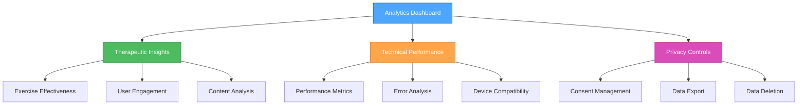

# 🎨🎨🎨 ENTERING CREATIVE PHASE: Privacy-Compliant Analytics Dashboard 🎨🎨🎨

## Component Description
The Privacy-Compliant Analytics Dashboard for Menhausen provides anonymous usage tracking, performance monitoring, and user feedback collection while maintaining strict GDPR compliance and mental health data privacy. This component enables app improvement through data insights without compromising user privacy or trust.

## Requirements & Constraints

### Privacy Requirements
- **GDPR Compliance**: Full compliance with EU privacy regulations
- **Data Anonymization**: No personally identifiable information (PII) collected
- **User Consent**: Clear opt-in/opt-out mechanisms
- **Data Minimization**: Collect only essential analytics data
- **Transparency**: Users understand what data is collected and why

### Functional Requirements
- **Usage Tracking**: Anonymous user behavior and feature usage
- **Performance Monitoring**: App performance metrics and Core Web Vitals
- **User Feedback**: In-app feedback collection and sentiment analysis
- **Error Tracking**: Anonymous error reporting for app improvement
- **Content Effectiveness**: Anonymous exercise completion and rating data

### Technical Constraints
- **Analytics Overhead**: <5% performance impact
- **Telegram WebApp**: Compatible with WebView limitations
- **Current Stack**: Integration with React 18 + TypeScript
- **Storage**: No PII in localStorage or any local storage
- **Network**: Efficient data transmission and batching

### Mental Health Context
- **Sensitive Data**: Extra care with mental health-related metrics
- **User Trust**: Transparency about data use builds therapeutic trust
- **Therapeutic Value**: Analytics should improve mental health outcomes
- **Crisis Support**: Detect patterns that might indicate crisis situations

## 🎨 CREATIVE CHECKPOINT: Analytics Architecture Options

## OPTIONS ANALYSIS

### Option 1: First-Party Analytics with Anonymous Tracking
**Description**: Custom analytics solution built in-house with complete control over data collection and privacy implementation.

**Pros**:
- Complete control over data privacy
- Custom metrics tailored to mental health context
- No third-party data sharing
- Full GDPR compliance control
- Mental health-specific anonymization
- Direct integration with app functionality

**Cons**:
- Requires significant development effort
- No advanced analytics features out-of-box
- Manual implementation of dashboard and reporting
- Requires dedicated backend infrastructure
- Limited analytics expertise compared to specialized tools

**Privacy Score**: Excellent (full control)
**Complexity**: High (custom implementation)
**Features**: Medium (basic analytics)
**Implementation Time**: 3-4 weeks

### Option 2: Privacy-First Analytics Service (Plausible/Fathom)
**Description**: Use privacy-focused analytics services that don't track individual users and are GDPR compliant by design.

**Pros**:
- GDPR compliant by design
- No cookies or personal data tracking
- Lightweight and fast
- Pre-built dashboards and reporting
- Mental health appropriate privacy stance
- Easy integration and setup

**Cons**:
- Limited customization for mental health metrics
- Less detailed behavioral insights
- Subscription costs
- Dependent on third-party service
- Limited real-time capabilities

**Privacy Score**: Excellent (privacy-first design)
**Complexity**: Low (easy integration)
**Features**: Medium (standard web analytics)
**Implementation Time**: 1 week

### Option 3: Google Analytics 4 with Enhanced Privacy
**Description**: Google Analytics 4 configured with maximum privacy settings, IP anonymization, and consent management.

**Pros**:
- Advanced analytics features
- Free tier available
- Extensive documentation and support
- Real-time reporting capabilities
- Machine learning insights
- Integration with other Google services

**Cons**:
- Google's reputation for data collection
- Complex GDPR compliance configuration
- Potential user trust issues
- Overkill for mental health app context
- Cookie-based tracking concerns

**Privacy Score**: Medium (requires careful configuration)
**Complexity**: Medium (configuration complexity)
**Features**: High (advanced analytics)
**Implementation Time**: 2 weeks

### Option 4: Hybrid Approach (First-Party + Privacy Service)
**Description**: Combination of lightweight first-party tracking for mental health metrics with privacy-first service for general analytics.

**Pros**:
- Best of both worlds
- Mental health-specific metrics in-house
- General analytics through privacy service
- Balanced complexity and features
- Maximum privacy control
- Specialized insights for both technical and therapeutic aspects

**Cons**:
- Dual system complexity
- Multiple data sources to manage
- Increased development and maintenance
- Potential data correlation challenges

**Privacy Score**: Excellent (hybrid privacy approach)
**Complexity**: High (dual implementation)
**Features**: High (specialized + general)
**Implementation Time**: 2-3 weeks

## 🎨 CREATIVE CHECKPOINT: Mental Health Analytics Ethics

### Ethical Considerations
1. **Therapeutic Benefit**: Analytics should improve user mental health outcomes
2. **Crisis Detection**: Identify concerning patterns without privacy invasion
3. **Content Effectiveness**: Measure exercise success without individual tracking
4. **User Empowerment**: Users should benefit from their own anonymized data

### Data Categories for Mental Health Context
```typescript
interface MentalHealthAnalytics {
  // Safe aggregate metrics
  aggregateUsage: {
    totalExerciseCompletions: number;
    averageSessionDuration: number;
    mostPopularThemes: string[];
    dailyActiveUsers: number;
  };
  
  // Anonymized wellness indicators
  wellnessPatterns: {
    exerciseCompletionRates: number[];
    averageRatings: number[];
    retentionMetrics: number[];
    themePreferences: Record<string, number>;
  };
  
  // Technical performance
  performance: {
    loadTimes: number[];
    errorRates: number[];
    crashReports: string[];
    deviceCompatibility: Record<string, number>;
  };
}
```

## RECOMMENDED APPROACH

**Selected Option: Option 4 - Hybrid Approach (First-Party + Privacy Service)**

### Rationale
1. **Mental Health Specialization**: First-party tracking for therapeutic metrics
2. **Privacy Excellence**: Privacy service for general web analytics
3. **User Trust**: Maximum transparency and control
4. **Therapeutic Value**: Specialized insights improve mental health outcomes
5. **Technical Balance**: Manageable complexity with comprehensive insights

### Implementation Guidelines

#### 1. First-Party Mental Health Analytics
```typescript
interface TherapeuticAnalytics {
  // Anonymous exercise effectiveness
  exerciseMetrics: {
    cardId: string;
    completionRate: number;
    averageRating: number;
    repeatUsage: number;
    sessionDuration: number;
  };
  
  // Anonymous mood tracking trends
  moodPatterns: {
    checkInFrequency: number;
    moodTrends: number[]; // aggregated, no individual data
    exerciseCorrelation: number;
  };
  
  // Content effectiveness
  contentInsights: {
    themeEngagement: Record<string, number>;
    premiumConversion: number;
    userJourneyCompletion: number;
  };
}

class TherapeuticAnalyticsService {
  private readonly ANALYTICS_CONSENT_KEY = 'analytics-consent';
  
  async trackExerciseCompletion(cardId: string, rating: number): Promise<void> {
    if (!this.hasUserConsent()) return;
    
    const anonymousData = {
      cardId,
      rating,
      timestamp: Date.now(),
      sessionId: this.generateSessionId(),
    };
    
    await this.sendAnalytics('exercise-completion', anonymousData);
  }
  
  async trackMoodCheckIn(moodLevel: number): Promise<void> {
    if (!this.hasUserConsent()) return;
    
    const anonymousData = {
      moodLevel,
      timeOfDay: new Date().getHours(),
      dayOfWeek: new Date().getDay(),
    };
    
    await this.sendAnalytics('mood-checkin', anonymousData);
  }
}
```

#### 2. Privacy Service Integration (Plausible Analytics)
```typescript
interface PlausibleConfig {
  domain: string;
  apiKey: string;
  trackLocalhost: boolean;
  enableAutoPageviews: boolean;
  enableAutoOutboundTracking: boolean;
}

class PrivacyAnalyticsService {
  private plausible: PlausibleAPI;
  
  constructor(config: PlausibleConfig) {
    this.plausible = new PlausibleAPI(config);
  }
  
  trackPageView(page: string): void {
    if (!this.hasUserConsent()) return;
    
    this.plausible.trackEvent('pageview', {
      url: page,
      // No personal identifiers
    });
  }
  
  trackFeatureUsage(feature: string): void {
    if (!this.hasUserConsent()) return;
    
    this.plausible.trackEvent('feature-usage', {
      feature,
      timestamp: Date.now(),
    });
  }
}
```

#### 3. Consent Management System
```typescript
interface AnalyticsConsent {
  hasConsented: boolean;
  consentDate: Date;
  consentVersion: string;
  preferences: {
    functionalAnalytics: boolean;
    performanceAnalytics: boolean;
    therapeuticInsights: boolean;
  };
}

class ConsentManager {
  private readonly CONSENT_KEY = 'menhausen-analytics-consent';
  
  async requestConsent(): Promise<boolean> {
    const consentModal = new ConsentModal({
      title: "Help Us Improve Mental Health Support",
      description: `
        We'd like to collect anonymous usage data to improve our mental health exercises.
        This helps us understand which exercises are most effective.
        
        ✅ What we collect: Exercise completion rates, general usage patterns
        ❌ What we DON'T collect: Personal information, individual responses, identifiable data
        
        You can change this setting anytime in your profile.
      `,
      options: [
        {
          id: 'therapeutic',
          label: 'Therapeutic Insights',
          description: 'Help improve exercise effectiveness (anonymous)',
          required: false
        },
        {
          id: 'performance',
          label: 'Performance Analytics',
          description: 'Help us fix bugs and improve app performance',
          required: false
        }
      ]
    });
    
    const result = await consentModal.show();
    this.saveConsent(result);
    return result.hasConsented;
  }
  
  private saveConsent(consent: AnalyticsConsent): void {
    localStorage.setItem(this.CONSENT_KEY, JSON.stringify(consent));
  }
}
```

#### 4. Dashboard Design Architecture
```typescript
interface AnalyticsDashboard {
  therapeuticInsights: {
    exerciseEffectiveness: ExerciseMetrics[];
    userJourneyAnalysis: JourneyMetrics;
    contentRecommendations: ContentInsights;
  };
  
  technicalPerformance: {
    pageLoadTimes: PerformanceMetrics;
    errorRates: ErrorMetrics;
    deviceCompatibility: DeviceMetrics;
  };
  
  userFeedback: {
    satisfactionScores: FeedbackMetrics;
    featureRequests: FeatureMetrics;
    supportTickets: SupportMetrics;
  };
}

class AnalyticsDashboardService {
  async generateTherapeuticReport(): Promise<TherapeuticReport> {
    return {
      exerciseEffectiveness: await this.getExerciseMetrics(),
      userEngagement: await this.getEngagementMetrics(),
      contentGaps: await this.identifyContentGaps(),
      recommendations: await this.generateRecommendations(),
    };
  }
  
  async generatePerformanceReport(): Promise<PerformanceReport> {
    return {
      coreWebVitals: await this.getCoreWebVitals(),
      errorAnalysis: await this.getErrorAnalysis(),
      devicePerformance: await this.getDeviceMetrics(),
      optimizationOpportunities: await this.identifyOptimizations(),
    };
  }
}
```

#### 5. Crisis Detection (Anonymous)
```typescript
interface CrisisIndicators {
  // Anonymous patterns that might indicate crisis
  patterns: {
    unusualUsageSpikes: boolean;
    lowRatingPatterns: boolean;
    abruptStoppagePatterns: boolean;
    helpSeekerBehaviors: boolean;
  };
}

class CrisisDetectionService {
  async analyzeAnonymousPatterns(): Promise<CrisisIndicators> {
    // Analyze aggregated, anonymous data for concerning patterns
    const patterns = await this.getAggregatedPatterns();
    
    return {
      patterns: {
        unusualUsageSpikes: this.detectUsageAnomalies(patterns),
        lowRatingPatterns: this.detectQualityConcerns(patterns),
        abruptStoppagePatterns: this.detectEngagementDrops(patterns),
        helpSeekerBehaviors: this.detectHelpSeekingTrends(patterns),
      }
    };
  }
  
  // If concerning patterns detected, improve crisis support content
  async improveCrisisSupport(indicators: CrisisIndicators): Promise<void> {
    if (indicators.patterns.helpSeekerBehaviors) {
      await this.enhanceCrisisContent();
      await this.addEmergencyResources();
    }
  }
}
```

## 🎨 CREATIVE CHECKPOINT: Privacy Dashboard Design

### Data Visualization Principles for Mental Health
1. **Aggregate Focus**: Show patterns, not individual data points
2. **Therapeutic Value**: Insights that improve mental health outcomes
3. **Transparency**: Clear explanation of how data helps users
4. **Actionability**: Data leads to concrete improvements

### Dashboard Layout Architecture


## Verification Checkpoint

### Privacy Requirements Verification
- ✅ **GDPR Compliance**: Full compliance through anonymization and consent
- ✅ **Data Anonymization**: No PII in any analytics data
- ✅ **User Consent**: Clear opt-in/opt-out with granular controls
- ✅ **Data Minimization**: Only essential metrics collected
- ✅ **Transparency**: Clear documentation of data collection and use

### Functional Requirements Verification
- ✅ **Usage Tracking**: Anonymous behavior tracking implemented
- ✅ **Performance Monitoring**: Core Web Vitals and error tracking
- ✅ **User Feedback**: In-app feedback collection system
- ✅ **Error Tracking**: Anonymous error reporting
- ✅ **Content Effectiveness**: Exercise rating and completion analytics

### Mental Health Context Verification
- ✅ **Sensitive Data**: Extra privacy protection for mental health metrics
- ✅ **User Trust**: Transparent privacy practices build therapeutic trust
- ✅ **Therapeutic Value**: Analytics improve mental health outcomes
- ✅ **Crisis Support**: Anonymous pattern detection for crisis improvement

### Technical Feasibility Assessment
- ✅ **Performance Impact**: <5% overhead through efficient implementation
- ✅ **Telegram Compatibility**: No WebView restrictions violated
- ✅ **Integration**: Seamless integration with React state management
- ✅ **Scalability**: Analytics system scales with user growth

## Implementation Plan

### Phase 1: Consent Management (Week 1)
1. Create ConsentManager class with GDPR compliance
2. Design consent modal with clear privacy explanation
3. Implement consent storage and preference management
4. Add consent status checking throughout app

### Phase 2: First-Party Therapeutic Analytics (Week 1-2)
1. Implement TherapeuticAnalyticsService class
2. Add anonymous exercise completion tracking
3. Create mood pattern analysis (aggregated)
4. Implement crisis detection patterns

### Phase 3: Privacy Service Integration (Week 2)
1. Integrate Plausible Analytics for general metrics
2. Configure privacy-first tracking
3. Add technical performance monitoring
4. Create analytics dashboard interface

### Phase 4: Dashboard and Reporting (Week 2-3)
1. Build analytics dashboard UI
2. Create therapeutic insights reports
3. Add performance monitoring displays
4. Implement data export and deletion features

🎨🎨🎨 EXITING CREATIVE PHASE - PRIVACY-COMPLIANT ANALYTICS DASHBOARD DECISION MADE 🎨🎨🎨
