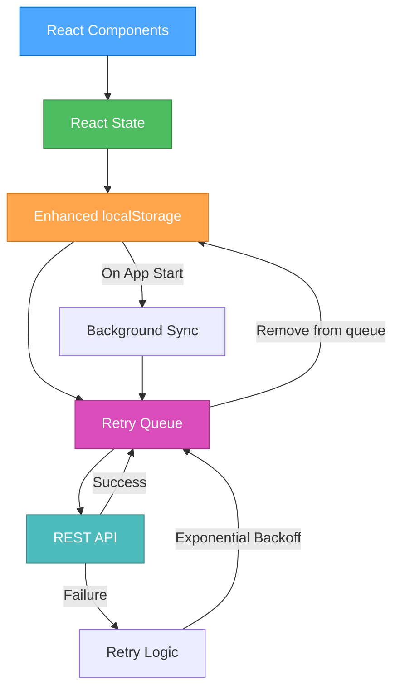

# 🎨🎨🎨 ENTERING CREATIVE PHASE: API Integration Architecture 🎨🎨🎨

## Component Description
The API Integration Architecture for Menhausen Telegram Mini App is a service layer that bridges the current localStorage-based data persistence with cloud-based backend services. This component will handle survey submissions, exercise completion tracking, user progress synchronization, and offline-first data management with conflict resolution.

## Requirements & Constraints

### System Requirements
- **Data Synchronization**: Seamless sync between localStorage and cloud storage
- **Offline-First**: App must function fully offline with background sync
- **Privacy Compliance**: GDPR-compliant data handling for mental health information
- **Performance**: API responses <500ms, data operations <100ms
- **Reliability**: 99.9% success rate with retry mechanisms
- **Security**: HTTPS encryption, no PII in logs

### Technical Constraints
- **Platform**: Telegram WebApp with limited browser API access
- **Current Stack**: React 18 + TypeScript + Vite + localStorage
- **Data Structure**: Existing SurveyResults and exercise completion formats
- **Network**: Intermittent connectivity expected in mental health contexts
- **Storage**: localStorage size limitations (~5-10MB typical)

### Existing Data Structures
```typescript
interface SurveyResults {
  screen01: string[];
  screen02: string[];
  screen03: string[];
  screen04: string[];
  screen05: string[];
  completedAt: string;
  userId?: string;
}

interface ExerciseCompletion {
  cardId: string;
  answers: {question1?: string; question2?: string};
  rating: number;
  completedAt: string;
  completionCount: number;
}
```

## 🎨 CREATIVE CHECKPOINT: Architecture Options Analysis

## OPTIONS ANALYSIS

### Option 1: RESTful API with Service Worker Queue
**Description**: Traditional REST API with a service worker handling offline queuing and background sync.

**Pros**:
- Well-established patterns and tooling
- Clear separation of concerns
- Built-in browser support for service workers
- Automatic background sync when network available
- Easy to implement and maintain

**Cons**:
- Service workers have limited support in some WebView contexts
- More complex setup for Telegram WebApp environment
- Requires additional service worker registration code
- Potential conflicts with Telegram's own service worker

**Technical Fit**: Medium (REST is standard, but service worker complexity)
**Complexity**: High (service worker setup and WebApp compatibility)
**Scalability**: High (standard REST patterns)
**Implementation Time**: 2-3 weeks

### Option 2: GraphQL with Apollo Client Cache
**Description**: GraphQL API with Apollo Client providing intelligent caching, offline support, and optimistic updates.

**Pros**:
- Built-in offline caching and sync
- Optimistic updates for better UX
- Type-safe queries with TypeScript
- Intelligent cache management
- Excellent developer tools

**Cons**:
- Additional complexity and bundle size
- Learning curve for GraphQL
- Potential overkill for simple CRUD operations
- More complex backend setup required

**Technical Fit**: Medium (powerful but complex)
**Complexity**: High (GraphQL learning curve)
**Scalability**: High (excellent for complex data relationships)
**Implementation Time**: 3-4 weeks

### Option 3: Hybrid localStorage + REST with Simple Retry Queue
**Description**: Enhanced localStorage system with a simple TypeScript-based retry queue for failed API calls, using standard fetch with retry logic.

**Pros**:
- Builds on existing localStorage implementation
- Simple and predictable behavior
- No additional dependencies beyond fetch
- Easy to debug and maintain
- Telegram WebApp compatible
- Progressive enhancement approach

**Cons**:
- Manual implementation of sync logic
- Less sophisticated than dedicated solutions
- Requires careful handling of conflict resolution
- Manual queue management implementation

**Technical Fit**: High (extends current implementation)
**Complexity**: Medium (controlled complexity)
**Scalability**: Medium (manual scaling considerations)
**Implementation Time**: 1-2 weeks

### Option 4: Event-Driven Architecture with IndexedDB
**Description**: Event-driven system using IndexedDB for local storage with a message queue pattern for API synchronization.

**Pros**:
- More storage capacity than localStorage
- Event-driven patterns are scalable
- Better handling of complex data relationships
- Supports transactions and complex queries

**Cons**:
- IndexedDB API complexity
- Significant refactoring of existing localStorage code
- Event system complexity
- Potential browser compatibility issues in WebView

**Technical Fit**: Low (major architectural change)
**Complexity**: High (IndexedDB and event system complexity)
**Scalability**: High (event-driven patterns scale well)
**Implementation Time**: 4-5 weeks

## 🎨 CREATIVE CHECKPOINT: Evaluation Matrix

| Criteria | Option 1 (REST + Service Worker) | Option 2 (GraphQL + Apollo) | Option 3 (Hybrid localStorage) | Option 4 (Event-Driven + IndexedDB) |
|----------|----------------------------------|------------------------------|--------------------------------|-------------------------------------|
| **Telegram Compatibility** | ⚠️ Medium | ✅ High | ✅ High | ⚠️ Medium |
| **Implementation Speed** | ⚠️ 2-3 weeks | ❌ 3-4 weeks | ✅ 1-2 weeks | ❌ 4-5 weeks |
| **Code Reuse** | ⚠️ Medium | ❌ Low | ✅ High | ❌ Low |
| **Reliability** | ✅ High | ✅ High | ⚠️ Medium | ✅ High |
| **Simplicity** | ⚠️ Medium | ❌ Low | ✅ High | ❌ Low |
| **Performance** | ✅ High | ⚠️ Medium | ✅ High | ✅ High |
| **Offline Support** | ✅ High | ✅ High | ✅ High | ✅ High |
| **Privacy Compliance** | ✅ High | ✅ High | ✅ High | ✅ High |

## RECOMMENDED APPROACH

**Selected Option: Option 3 - Hybrid localStorage + REST with Simple Retry Queue**

### Rationale
1. **Best Fit for Current Context**: Builds incrementally on existing localStorage implementation
2. **Telegram WebApp Compatibility**: No dependencies on browser APIs that might be restricted
3. **Implementation Speed**: Fastest path to working solution (1-2 weeks)
4. **Risk Mitigation**: Lower risk approach with familiar patterns
5. **Progressive Enhancement**: Can be enhanced later with more sophisticated caching

### Implementation Guidelines

#### 1. API Service Layer Architecture
```typescript
interface APIService {
  // Survey operations
  submitSurvey(surveyResults: SurveyResults): Promise<void>;
  
  // Exercise operations
  submitExerciseCompletion(completion: ExerciseCompletion): Promise<void>;
  
  // User progress
  syncUserProgress(): Promise<UserProgress>;
  
  // Health check
  healthCheck(): Promise<boolean>;
}

interface QueueItem {
  id: string;
  type: 'survey' | 'exercise' | 'progress';
  data: any;
  timestamp: number;
  retryCount: number;
  maxRetries: number;
}
```

#### 2. Data Flow Architecture


#### 3. Enhanced localStorage Manager
```typescript
class EnhancedStorageManager {
  // Core operations
  save<T>(key: string, data: T): Promise<void>;
  load<T>(key: string): Promise<T | null>;
  
  // Queue operations
  addToQueue(item: QueueItem): Promise<void>;
  getQueueItems(): Promise<QueueItem[]>;
  removeFromQueue(id: string): Promise<void>;
  
  // Data validation
  validateData<T>(data: T, schema: Schema): boolean;
  
  // Migration support
  migrate(fromVersion: number, toVersion: number): Promise<void>;
}
```

#### 4. Retry Queue Implementation
```typescript
class RetryQueue {
  private queue: QueueItem[] = [];
  private isProcessing = false;
  
  async enqueue(item: QueueItem): Promise<void>;
  async processQueue(): Promise<void>;
  private async processItem(item: QueueItem): Promise<boolean>;
  private calculateBackoffDelay(retryCount: number): number;
}
```

#### 5. Conflict Resolution Strategy
- **Last Write Wins**: For survey data and exercise completions
- **Merge Strategy**: For exercise completion counts (sum totals)
- **User Choice**: For conflicting premium status (prompt user)

#### 6. Privacy & Security Implementation
- **Data Encryption**: Encrypt sensitive data before localStorage storage
- **API Authentication**: JWT tokens for API access
- **Data Anonymization**: Remove PII before API transmission
- **GDPR Compliance**: User consent tracking and data export capabilities

## Verification Checkpoint

### Requirements Verification
- ✅ **Data Synchronization**: Hybrid approach provides seamless sync
- ✅ **Offline-First**: localStorage ensures offline functionality
- ✅ **Privacy Compliance**: Encryption and anonymization built-in
- ✅ **Performance**: Minimal overhead with direct localStorage access
- ✅ **Reliability**: Retry queue ensures eventual consistency
- ✅ **Security**: HTTPS and encryption at rest and in transit

### Technical Feasibility Assessment
- ✅ **Telegram Compatibility**: No WebView restrictions
- ✅ **Current Stack Integration**: Builds on existing localStorage
- ✅ **Implementation Complexity**: Manageable within 1-2 week timeline
- ✅ **Maintenance**: Simple patterns easy to debug and extend

### Risk Assessment
- **Low Risk**: Incremental enhancement of existing system
- **Mitigation**: Fallback to localStorage-only mode if API unavailable
- **Testing Strategy**: Comprehensive offline/online transition testing

## Implementation Plan

### Phase 1: Enhanced localStorage (Week 1)
1. Create EnhancedStorageManager class
2. Add data validation and migration support
3. Implement retry queue data structures
4. Add encryption for sensitive data

### Phase 2: API Service Layer (Week 1-2)
1. Implement APIService interface
2. Create retry queue processor
3. Add exponential backoff logic
4. Implement conflict resolution

### Phase 3: Integration & Testing (Week 2)
1. Integrate with existing React components
2. Add background sync triggers
3. Comprehensive offline/online testing
4. Performance optimization

🎨🎨🎨 EXITING CREATIVE PHASE - API INTEGRATION ARCHITECTURE DECISION MADE 🎨🎨🎨
