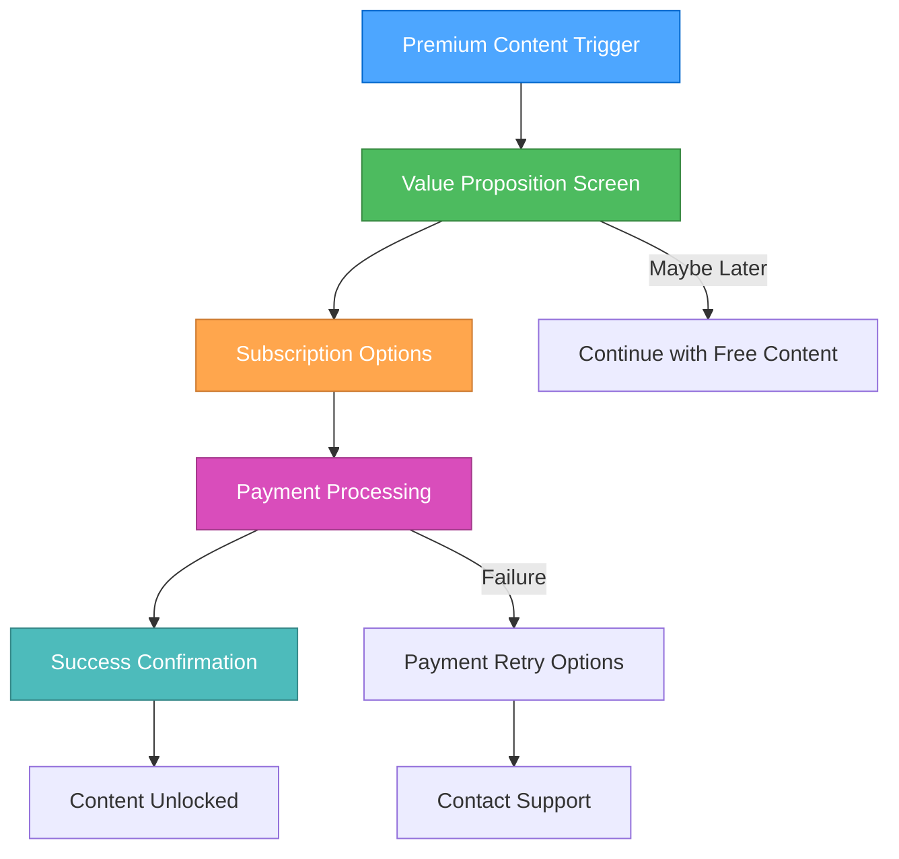
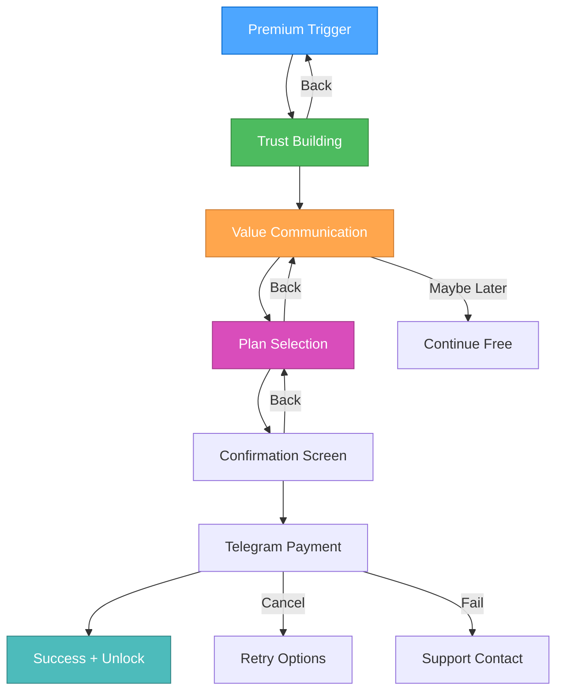

# 🎨🎨🎨 ENTERING CREATIVE PHASE: Payment Flow UX Design 🎨🎨🎨

## Component Description
The Payment Flow UX for Menhausen Telegram Mini App enables users to upgrade to premium content access through a seamless, secure, and Telegram-compatible payment experience. This component handles subscription management, premium content unlocking, and payment processing while maintaining the app's mental health focus and user trust.

## Requirements & Constraints

### User Experience Requirements
- **Seamless Integration**: Payment flow feels native to the mental health journey
- **Trust Building**: Clear value proposition and secure payment indicators
- **Accessibility**: Simple 3-step process maximum
- **Progress Preservation**: Never lose user progress during payment flow
- **Recovery Support**: Clear path back to content after payment

### Business Requirements
- **Subscription Model**: Monthly and annual subscription options
- **Premium Content**: Unlock advanced exercises and features
- **Trial Support**: Free trial period for premium features
- **Receipt Management**: Clear receipts and subscription status
- **Cancellation**: Easy subscription management

### Technical Constraints
- **Telegram Platform**: Must work within Telegram WebApp limitations
- **Payment Methods**: Telegram Payments API or web-based redirect
- **Security**: PCI DSS compliance requirements
- **Current Stack**: React 18 + TypeScript integration
- **State Management**: Integration with existing premium status tracking

### Mental Health Context
- **Sensitive Timing**: Avoid interrupting therapeutic moments
- **Value Clarity**: Clear benefit communication for mental health outcomes
- **Trust Factors**: Privacy and security emphasis for sensitive data
- **Support Access**: Easy access to help during payment issues

## 🎨 CREATIVE CHECKPOINT: Payment Flow Options Analysis

## OPTIONS ANALYSIS

### Option 1: Telegram Payments API Integration
**Description**: Native integration with Telegram's built-in payment system using their API directly within the WebApp.

**Pros**:
- Native Telegram experience
- No external redirects
- Built-in security and PCI compliance
- User payment methods already stored in Telegram
- Seamless WebApp integration
- Familiar UI patterns for Telegram users

**Cons**:
- Limited payment method options
- Dependent on Telegram's payment ecosystem
- Less control over payment UX customization
- Potential regional limitations
- Limited analytics and tracking options

**Technical Fit**: High (designed for Telegram WebApps)
**Complexity**: Low (Telegram handles payment processing)
**Security**: High (PCI compliance built-in)
**Implementation Time**: 1 week

### Option 2: Stripe Embedded Payment Links
**Description**: Stripe payment links opened in a new window/tab with automatic return to the WebApp after completion.

**Pros**:
- Full Stripe feature set
- Extensive payment method support
- Advanced analytics and reporting
- Customizable payment experience
- Strong fraud protection
- International payment support

**Cons**:
- Context switching between apps
- Potential user confusion with redirects
- Need to handle return flow carefully
- More complex state management
- Additional Stripe integration complexity

**Technical Fit**: Medium (requires careful redirect handling)
**Complexity**: High (redirect flow and state management)
**Security**: High (Stripe's PCI compliance)
**Implementation Time**: 2-3 weeks

### Option 3: In-App Stripe Elements (WebView Embedded)
**Description**: Stripe Elements embedded directly in the WebApp with custom payment form integrated into the app flow.

**Pros**:
- Seamless in-app experience
- Full control over payment UX
- No context switching
- Advanced customization options
- Integrated analytics
- Premium feel and branding

**Cons**:
- Complex WebView compatibility
- Potential security restrictions in Telegram
- More development and testing required
- PCI compliance considerations
- Risk of payment form restrictions

**Technical Fit**: Low (WebView restrictions may block)
**Complexity**: High (security and compliance complexity)
**Security**: Medium (dependent on WebView capabilities)
**Implementation Time**: 3-4 weeks

### Option 4: Hybrid Approach (Telegram Primary + Stripe Fallback)
**Description**: Primary integration with Telegram Payments API, with Stripe as fallback for unsupported regions or payment methods.

**Pros**:
- Best of both worlds
- Maximum user coverage
- Graceful degradation
- Regional optimization
- Payment method diversity
- Risk mitigation

**Cons**:
- Complex implementation
- Multiple payment systems to maintain
- Increased testing complexity
- Potential user confusion
- Higher development overhead

**Technical Fit**: Medium (complexity of dual integration)
**Complexity**: High (two payment systems)
**Security**: High (both systems are secure)
**Implementation Time**: 3-4 weeks

## 🎨 CREATIVE CHECKPOINT: UX Flow Evaluation

### Payment Trigger Points Analysis
1. **Card Detail View**: When user attempts to access premium card
2. **Theme Completion**: After completing free cards in a theme
3. **Profile Enhancement**: When accessing advanced progress features
4. **Onboarding End**: Optional upgrade after initial survey completion

### User Journey Mapping


## RECOMMENDED APPROACH

**Selected Option: Option 1 - Telegram Payments API Integration**

### Rationale
1. **Platform Alignment**: Native Telegram experience builds trust
2. **Technical Simplicity**: Fastest implementation with lowest risk
3. **Security**: Built-in PCI compliance and security
4. **User Familiarity**: Telegram users already understand the payment flow
5. **Mental Health Context**: Minimizes friction during sensitive moments

### Implementation Guidelines

#### 1. Value Proposition Screen Design
```typescript
interface ValuePropositionProps {
  triggerContext: 'card' | 'theme' | 'profile' | 'onboarding';
  currentProgress: UserProgress;
  premiumFeatures: PremiumFeature[];
}

const ValueProposition = {
  headline: "Unlock Your Full Mental Health Journey",
  benefits: [
    "Access to advanced therapeutic exercises",
    "Personalized mood tracking insights", 
    "Unlimited exercise repetitions",
    "Progress visualization dashboard",
    "Priority support from mental health professionals"
  ],
  socialProof: "Join 10,000+ users improving their mental health",
  guarantee: "7-day free trial, cancel anytime"
}
```

#### 2. Subscription Options Design
```typescript
interface SubscriptionOption {
  id: string;
  name: string;
  price: number;
  period: 'monthly' | 'annual';
  savings?: string;
  features: string[];
  recommended?: boolean;
}

const subscriptionOptions: SubscriptionOption[] = [
  {
    id: 'monthly',
    name: 'Monthly Premium',
    price: 9.99,
    period: 'monthly',
    features: ['All premium exercises', 'Advanced analytics', 'Priority support']
  },
  {
    id: 'annual',
    name: 'Annual Premium',
    price: 79.99,
    period: 'annual',
    savings: 'Save 33%',
    features: ['All monthly features', 'Exclusive content', 'Personal coach chat'],
    recommended: true
  }
];
```

#### 3. Telegram Payment Integration
```typescript
interface TelegramPaymentConfig {
  provider_token: string;
  start_parameter: string;
  currency: string;
  prices: LabeledPrice[];
  max_tip_amount?: number;
  suggested_tip_amounts?: number[];
}

class TelegramPaymentService {
  async initializePayment(subscriptionId: string): Promise<void> {
    const invoice = await this.createInvoice(subscriptionId);
    
    if (window.Telegram?.WebApp?.openInvoice) {
      window.Telegram.WebApp.openInvoice(invoice.url, (status) => {
        this.handlePaymentResult(status, subscriptionId);
      });
    }
  }
  
  private handlePaymentResult(status: string, subscriptionId: string): void {
    switch (status) {
      case 'paid':
        this.unlockPremiumContent();
        this.showSuccessMessage();
        break;
      case 'cancelled':
        this.showRetryOptions();
        break;
      case 'failed':
        this.showSupportOptions();
        break;
    }
  }
}
```

#### 4. Payment Flow State Management
```typescript
interface PaymentState {
  isProcessing: boolean;
  selectedPlan: SubscriptionOption | null;
  paymentStatus: 'pending' | 'processing' | 'success' | 'failed' | 'cancelled';
  userHasPremium: boolean;
  subscriptionDetails: SubscriptionDetails | null;
  trialEndDate: Date | null;
}

const usePaymentFlow = () => {
  const [paymentState, setPaymentState] = useState<PaymentState>(initialState);
  
  const initiatePayment = async (plan: SubscriptionOption) => {
    // Implementation
  };
  
  const unlockPremiumContent = () => {
    // Update user state and content access
  };
  
  return { paymentState, initiatePayment, unlockPremiumContent };
};
```

#### 5. Premium Content Unlocking Logic
```typescript
class PremiumContentManager {
  constructor(private userState: UserState) {}
  
  isContentAvailable(cardId: string): boolean {
    const card = this.getCard(cardId);
    return !card.isPremium || this.userState.hasPremiumAccess;
  }
  
  unlockPremiumFeatures(): void {
    // Update user preferences
    this.userState.setHasPremium(true);
    
    // Update localStorage
    localStorage.setItem('user-premium-status', 'true');
    
    // Sync with API
    this.apiService.updatePremiumStatus(true);
    
    // Update content access
    this.refreshContentAccess();
  }
}
```

#### 6. Error Handling and Recovery
```typescript
interface PaymentErrorHandler {
  handlePaymentCancelled(): void;
  handlePaymentFailed(error: PaymentError): void;
  handleNetworkError(): void;
  showRetryOptions(): void;
  provideSupportContact(): void;
}

const paymentErrorMessages = {
  cancelled: "Payment cancelled. Your free content is still available.",
  failed: "Payment failed. Please try again or contact support.",
  network: "Connection issue. Your payment is being processed.",
  support: "Need help? Chat with our support team."
};
```

## 🎨 CREATIVE CHECKPOINT: UX Design Specifications

### Visual Design Principles
1. **Trust Indicators**: Security badges, encryption notices, money-back guarantee
2. **Value Emphasis**: Clear before/after premium feature comparisons
3. **Progress Preservation**: "Your progress is saved" messaging during payment
4. **Mental Health Focus**: Therapeutic language, calming colors, supportive messaging

### Interaction Design


### Accessibility Considerations
- **Screen Reader Support**: Clear payment amount and subscription terms
- **Touch Targets**: Minimum 44px buttons for payment actions
- **Color Contrast**: High contrast for payment security indicators
- **Font Size**: Minimum 16px to prevent iOS zoom during payment entry

## Verification Checkpoint

### User Experience Verification
- ✅ **Seamless Integration**: Native Telegram payment feels integrated
- ✅ **Trust Building**: Security indicators and clear value proposition
- ✅ **Accessibility**: 3-step maximum process with clear navigation
- ✅ **Progress Preservation**: User data remains intact throughout flow
- ✅ **Recovery Support**: Clear error handling and support options

### Business Requirements Verification
- ✅ **Subscription Model**: Monthly/annual options with trial support
- ✅ **Premium Content**: Clear content unlocking mechanism
- ✅ **Receipt Management**: Telegram handles receipts automatically
- ✅ **Cancellation**: Telegram provides subscription management

### Technical Feasibility Assessment
- ✅ **Telegram Platform**: Native API integration ensures compatibility
- ✅ **Security**: PCI DSS compliance through Telegram's system
- ✅ **Implementation**: Simple integration with existing React state
- ✅ **Performance**: Minimal impact on app performance

### Mental Health Context Verification
- ✅ **Sensitive Timing**: Non-disruptive payment triggers
- ✅ **Value Clarity**: Clear mental health benefit communication
- ✅ **Trust Factors**: Privacy and security emphasis maintained
- ✅ **Support Access**: Direct support contact integration

## Implementation Plan

### Phase 1: Payment Flow UI (Week 1)
1. Create ValuePropositionScreen component
2. Design SubscriptionOptionsScreen with plan selection
3. Implement PaymentConfirmationScreen
4. Add premium content unlock UI feedback

### Phase 2: Telegram Payment Integration (Week 1)
1. Implement TelegramPaymentService class
2. Add invoice creation and payment handling
3. Integrate payment result callbacks
4. Test payment flow end-to-end

### Phase 3: Premium Content Management (Week 1)
1. Create PremiumContentManager class
2. Update content access logic throughout app
3. Add subscription status synchronization
4. Implement error handling and recovery flows

🎨🎨🎨 EXITING CREATIVE PHASE - PAYMENT FLOW UX DESIGN DECISION MADE 🎨🎨🎨
