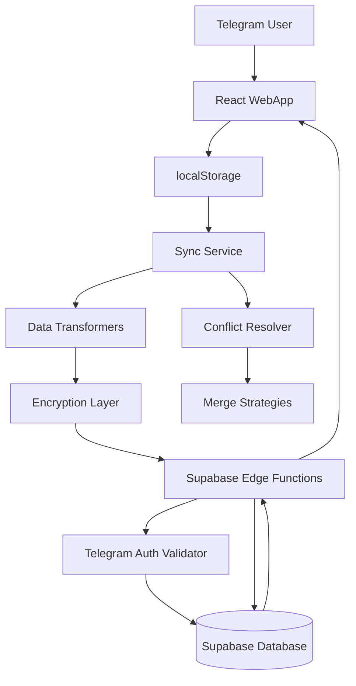
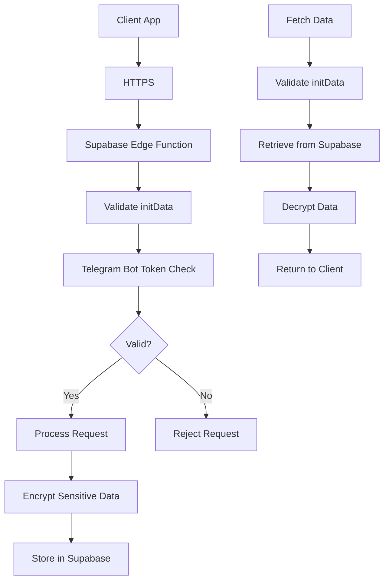

# Telegram User API Sync - Comprehensive Architectural Plan

## Document Information
- **Task**: Telegram Users API Sync with Supabase
- **Complexity**: Level 4 - Complex System
- **Created**: 2025-12-14
- **Status**: Planning Phase

---

## 1. EXECUTIVE SUMMARY

### Problem Statement
Telegram users currently store all application data locally in localStorage. When users switch devices or clear browser data, they lose all progress, achievements, check-ins, and preferences. We need a cloud-based synchronization system that:
- Syncs all localStorage data (except card answers) to Supabase
- Enables multi-device access
- Maintains data privacy and security
- Handles conflicts intelligently
- Works seamlessly with existing Telegram authentication

### Solution Overview
Implement a comprehensive sync system using Supabase as the backend, with:
- Real-time sync on localStorage changes
- Intelligent conflict resolution (remote wins, smart merging)
- Server-side Telegram authentication validation
- Client-side encryption for sensitive data
- Incremental sync for performance
- Automatic migration for existing users

---

## 2. BUSINESS CONTEXT

### Business Objectives
1. **User Retention**: Enable seamless device switching to improve user experience
2. **Data Protection**: Prevent data loss from device changes or browser clearing
3. **Platform Growth**: Support multi-device usage patterns
4. **User Trust**: Maintain privacy with encryption and secure authentication

### Key Stakeholders
- **End Users**: Telegram users of the Menhausen app
- **Development Team**: Implementing and maintaining the sync system
- **Product Team**: Defining requirements and prioritizing features

### Business Constraints
- Must work within Telegram WebApp environment
- Cannot disrupt existing user experience
- Must comply with data privacy regulations
- Limited backend infrastructure (Supabase only)
- Budget constraints for Supabase usage

### Business Metrics
- Sync success rate: >99%
- Sync latency: <2 seconds for incremental updates
- User adoption: 100% auto-migration
- Data integrity: Zero data loss incidents

### Business Risks
- **Data Loss Risk**: High impact if sync fails
- **Privacy Breach Risk**: High impact if authentication compromised
- **Performance Degradation**: Medium impact if sync slows app
- **Cost Overruns**: Medium impact if Supabase usage exceeds budget

---

## 3. ARCHITECTURAL VISION AND GOALS

### Vision Statement
Create a seamless, secure, and performant cloud synchronization system that enables users to access their mental health journey data across all devices while maintaining the highest standards of privacy and data protection.

### Strategic Goals
1. **Seamless Multi-Device Experience**: Users can switch devices without losing any data
2. **Data Privacy First**: All sensitive data encrypted, Telegram auth validated server-side
3. **Performance Optimized**: Minimal impact on app performance, incremental sync
4. **Reliability Guaranteed**: 99.9% sync success rate with conflict resolution
5. **Future-Proof Architecture**: Scalable to millions of users, extensible for new data types

### Quality Attributes
- **Performance**: Sync operations <2s, no UI blocking
- **Security**: Encryption at rest and in transit, Telegram auth validation
- **Reliability**: 99.9% sync success, automatic retry with exponential backoff
- **Scalability**: Support 100K+ concurrent users
- **Maintainability**: Clear separation of concerns, comprehensive testing

### Technical Roadmap
- **Phase 1 (Weeks 1-2)**: Supabase schema, Telegram auth, basic sync infrastructure
- **Phase 2 (Weeks 3-4)**: Client sync service, data transformers, conflict resolution
- **Phase 3 (Weeks 5-6)**: Real-time sync, encryption layer, migration system
- **Phase 4 (Week 7)**: Testing, optimization, deployment

---

## 4. ARCHITECTURAL PRINCIPLES

### Principle 1: Security First
- **Statement**: All sensitive data must be encrypted before transmission and storage
- **Rationale**: Mental health data is highly sensitive and requires maximum protection
- **Implications**: 
  - Client-side encryption for sensitive fields
  - Server-side Telegram initData validation
  - Secure API endpoints with authentication
- **Examples**: 
  - Survey results encrypted before sync
  - Check-in mood data encrypted
  - Card progress without answers (answers encrypted separately when implemented)

### Principle 2: Offline-First Architecture
- **Statement**: App must function offline, with sync as enhancement
- **Rationale**: Users may have unreliable network, app should never block on sync
- **Implications**:
  - localStorage remains source of truth locally
  - Sync happens asynchronously
  - Failed syncs queued and retried
- **Examples**:
  - User can complete check-in offline
  - Sync happens in background when online
  - Failed syncs don't block user actions

### Principle 3: Incremental Sync
- **Statement**: Only sync changed data to minimize bandwidth and latency
- **Rationale**: Reduces costs, improves performance, scales better
- **Implications**:
  - Track what changed since last sync
  - Send only delta updates
  - Merge strategies for concurrent changes
- **Examples**:
  - Single check-in syncs only that day's data
  - Points transaction syncs only new transactions
  - Card progress syncs only changed cards

### Principle 4: Conflict Resolution Strategy
- **Statement**: Remote wins for preferences/flags, smart merge for collections
- **Rationale**: Server is source of truth for global state, local collections merge intelligently
- **Implications**:
  - Preferences: Remote overwrites local
  - Collections (check-ins, transactions): Merge by unique identifiers
  - Achievements: Merge by achievementId
- **Examples**:
  - Language preference: Remote wins
  - Check-ins: Merge by date_key, keep both
  - Points transactions: Merge by transaction_id, dedupe

### Principle 5: Data Transformation at Boundaries
- **Statement**: Transform data at sync boundaries, keep internal formats consistent
- **Rationale**: Separation of concerns, easier to maintain and test
- **Implications**:
  - Transform localStorage format to API format on sync
  - Transform API format to localStorage format on fetch
  - Keep internal app logic unchanged
- **Examples**:
  - Card progress: Remove answers before sync
  - Check-ins: Normalize format for API
  - User stats: Flatten nested objects for API

---

## 5. REQUIREMENTS ANALYSIS

### Functional Requirements

#### FR1: User Authentication
- **FR1.1**: Validate Telegram WebApp initData server-side
- **FR1.2**: Extract and store telegram_user_id as primary key
- **FR1.3**: Reject requests with invalid or expired initData
- **Priority**: Critical

#### FR2: Data Synchronization
- **FR2.1**: Sync all localStorage keys except card answers
- **FR2.2**: Real-time sync on localStorage changes (debounced)
- **FR2.3**: Initial sync on app load for existing users
- **FR2.4**: Incremental sync for changed data only
- **Priority**: Critical

#### FR3: Data Types to Sync
- **FR3.1**: Survey results (survey-results, menhausen_survey_results)
- **FR3.2**: Daily check-ins (daily_checkin_YYYY-MM-DD, checkin-data)
- **FR3.3**: User statistics (menhausen_user_stats)
- **FR3.4**: Achievements (menhausen_achievements)
- **FR3.5**: Points (menhausen_points_balance, menhausen_points_transactions)
- **FR3.6**: User preferences (menhausen_user_preferences, menhausen-language)
- **FR3.7**: App flow progress (app-flow-progress)
- **FR3.8**: Psychological test results (psychological-test-results)
- **FR3.9**: Card progress without answers (theme_card_progress_*)
- **FR3.10**: Referral data (referred_by, referral_code, etc.)
- **Priority**: Critical

#### FR4: Conflict Resolution
- **FR4.1**: Remote wins for preferences and flags
- **FR4.2**: Smart merge for collections (check-ins, transactions)
- **FR4.3**: Merge arrays by unique identifiers
- **FR4.4**: Update local storage with merged data
- **Priority**: High

#### FR5: Data Encryption
- **FR5.1**: Encrypt sensitive data before sync (survey, check-ins, test results)
- **FR5.2**: Decrypt on fetch
- **FR5.3**: Maintain existing CriticalDataManager encryption
- **Priority**: High

#### FR6: Migration
- **FR6.1**: Auto-detect existing localStorage data
- **FR6.2**: Auto-sync on first app load after deployment
- **FR6.3**: Background sync without user action
- **Priority**: High

### Non-Functional Requirements

#### NFR1: Performance
- **NFR1.1**: Sync operations complete in <2 seconds
- **NFR1.2**: No UI blocking during sync
- **NFR1.3**: Debounce rapid localStorage changes (100-200ms)
- **NFR1.4**: Batch multiple changes when possible
- **Target**: <2s for incremental sync, <5s for full sync

#### NFR2: Security
- **NFR2.1**: Server-side Telegram initData validation
- **NFR2.2**: Encryption for sensitive data fields
- **NFR2.3**: HTTPS for all API communication
- **NFR2.4**: Rate limiting on API endpoints
- **Target**: Zero security incidents

#### NFR3: Reliability
- **NFR3.1**: 99.9% sync success rate
- **NFR3.2**: Automatic retry with exponential backoff
- **NFR3.3**: Offline queue for failed syncs
- **NFR3.4**: Conflict resolution handles all edge cases
- **Target**: 99.9% success rate

#### NFR4: Scalability
- **NFR4.1**: Support 100K+ concurrent users
- **NFR4.2**: Efficient database queries
- **NFR4.3**: Incremental sync reduces load
- **NFR4.4**: Indexed database tables
- **Target**: 100K+ users, linear cost scaling

#### NFR5: Maintainability
- **NFR5.1**: Clear separation of concerns
- **NFR5.2**: Comprehensive test coverage (>80%)
- **NFR5.3**: Well-documented code and APIs
- **NFR5.4**: Type-safe TypeScript throughout
- **Target**: >80% test coverage, clear documentation

---

## 6. ARCHITECTURAL CONSTRAINTS

### Technical Constraints
1. **Supabase Only**: Backend must use Supabase (no custom servers)
2. **Telegram WebApp**: Must work within Telegram WebApp environment
3. **LocalStorage API**: Existing app uses localStorage, must maintain compatibility
4. **React/TypeScript**: Frontend is React 18 with TypeScript
5. **No Breaking Changes**: Cannot break existing functionality

### Organizational Constraints
1. **Budget**: Supabase usage must stay within budget limits
2. **Timeline**: Must complete within 7 weeks
3. **Team Size**: Limited development resources

### External Constraints
1. **Telegram API**: Must use Telegram WebApp API for authentication
2. **Supabase Limits**: Subject to Supabase free tier or paid plan limits
3. **Data Privacy Regulations**: GDPR compliance required for EU users

### Regulatory/Compliance Constraints
1. **GDPR**: User data must be properly encrypted and managed
2. **Data Minimization**: Only sync necessary data
3. **Right to Deletion**: Users must be able to delete their data

---

## 7. ARCHITECTURAL ALTERNATIVES

### Alternative 1: Full Sync on Every Change
- **Description**: Sync all data on every localStorage change
- **Advantages**:
  - Simple implementation
  - Always in sync
- **Disadvantages**:
  - High bandwidth usage
  - Slow performance
  - Expensive (more API calls)
- **Risks**:
  - Performance degradation
  - Cost overruns
  - User experience issues
- **Evaluation Score**: 3/10

### Alternative 2: Periodic Full Sync
- **Description**: Sync all data periodically (e.g., every 5 minutes)
- **Advantages**:
  - Predictable API usage
  - Lower complexity
- **Disadvantages**:
  - Data can be stale
  - Still high bandwidth
  - Not real-time
- **Risks**:
  - Data inconsistency
  - Poor user experience
- **Evaluation Score**: 5/10

### Alternative 3: Incremental Sync with Debouncing (SELECTED)
- **Description**: Sync only changed data, debounce rapid changes
- **Advantages**:
  - Low bandwidth usage
  - Fast performance
  - Real-time feel
  - Cost-effective
- **Disadvantages**:
  - More complex implementation
  - Need to track changes
- **Risks**:
  - Implementation complexity (manageable)
  - Change tracking bugs (mitigated with testing)
- **Evaluation Score**: 9/10

### Alternative 4: Supabase Realtime
- **Description**: Use Supabase Realtime for push-based sync
- **Advantages**:
  - True real-time
  - Efficient for multi-device
- **Disadvantages**:
  - More complex
  - Higher cost
  - Requires WebSocket support
- **Risks**:
  - WebSocket compatibility issues
  - Higher Supabase costs
- **Evaluation Score**: 7/10 (not selected due to complexity and cost)

## Recommended Approach: Alternative 3 (Incremental Sync with Debouncing)

**Justification**:
- Best balance of performance, cost, and user experience
- Real-time feel without high bandwidth costs
- Fits within Supabase free tier limits
- Manageable complexity with proper architecture

---

## 8. SYSTEM ARCHITECTURE

### High-Level Architecture



### Component Architecture

#### Frontend Components

**1. Sync Service (`utils/supabaseSync/supabaseSyncService.ts`)**
- **Responsibilities**:
  - Intercept localStorage changes
  - Queue sync operations
  - Debounce rapid changes
  - Coordinate full and incremental syncs
  - Handle sync status and errors
- **Interfaces**:
  - `syncData(dataType: string, data: any): Promise<void>`
  - `syncAll(): Promise<void>`
  - `getSyncStatus(): SyncStatus`

**2. Data Transformers (`utils/supabaseSync/dataTransformers.ts`)**
- **Responsibilities**:
  - Transform localStorage format to API format
  - Remove card answers from card progress
  - Normalize data structures
  - Handle encryption preparation
- **Interfaces**:
  - `transformForSync(key: string, value: any): any`
  - `transformFromAPI(dataType: string, data: any): any`
  - `removeCardAnswers(cardProgress: any): any`

**3. Conflict Resolver (`utils/supabaseSync/conflictResolver.ts`)**
- **Responsibilities**:
  - Merge local and remote data
  - Apply merge strategies (remote wins, smart merge)
  - Handle edge cases
  - Update localStorage with merged data
- **Interfaces**:
  - `resolveConflict(dataType: string, local: any, remote: any): any`
  - `mergeCheckins(local: Checkin[], remote: Checkin[]): Checkin[]`
  - `mergeTransactions(local: Transaction[], remote: Transaction[]): Transaction[]`

**4. Encryption Layer (`utils/supabaseSync/encryption.ts`)**
- **Responsibilities**:
  - Encrypt sensitive data before sync
  - Decrypt data after fetch
  - Integrate with CriticalDataManager
- **Interfaces**:
  - `encryptSensitiveData(data: any): string`
  - `decryptSensitiveData(encrypted: string): any`
  - `shouldEncrypt(dataType: string): boolean`

**5. Telegram Auth Service (`utils/telegramAuth/telegramAuthService.ts`)**
- **Responsibilities**:
  - Extract Telegram user ID
  - Prepare initData for server validation
  - Handle auth errors
- **Interfaces**:
  - `getTelegramUserId(): string | null`
  - `getTelegramInitData(): string | null`
  - `validateTelegramAuth(): Promise<boolean>`

#### Backend Components (Supabase Edge Functions)

**1. Sync User Data Function (`/functions/v1/sync-user-data`)**
- **Responsibilities**:
  - Validate Telegram authentication
  - Handle full data sync
  - Apply conflict resolution
  - Store data in Supabase
  - Return sync status
- **Endpoints**: `POST /functions/v1/sync-user-data`

**2. Get User Data Function (`/functions/v1/get-user-data`)**
- **Responsibilities**:
  - Validate Telegram authentication
  - Fetch all user data from Supabase
  - Return formatted data
- **Endpoints**: `GET /functions/v1/get-user-data`

**3. Sync Data Type Function (`/functions/v1/sync-data-type`)**
- **Responsibilities**:
  - Validate Telegram authentication
  - Handle incremental sync for single data type
  - Merge with existing data
  - Return success status
- **Endpoints**: `PATCH /functions/v1/sync-data-type`

**4. Telegram Auth Validator (`/functions/v1/validate-telegram-auth`)**
- **Responsibilities**:
  - Validate Telegram WebApp initData
  - Verify bot token
  - Check data expiration
  - Return user ID if valid
- **Utilities**: Used by other functions

### Data Architecture

#### Database Schema (Supabase PostgreSQL)

See detailed schema in Section 9 (Database Schema).

#### Data Flow

**Sync Flow (Local to Remote)**:
1. User action triggers localStorage change
2. Sync service intercepts change
3. Data transformer converts format
4. Encryption layer encrypts sensitive data
5. API call to Supabase Edge Function
6. Telegram auth validation
7. Data stored in Supabase
8. Sync status updated

**Fetch Flow (Remote to Local)**:
1. App loads or sync triggered
2. API call to get user data
3. Telegram auth validation
4. Data fetched from Supabase
5. Conflict resolver merges with local
6. Decryption layer decrypts sensitive data
7. Data transformer converts to localStorage format
8. localStorage updated
9. App state updated

### Security Architecture



**Security Layers**:
1. **Transport**: HTTPS for all API calls
2. **Authentication**: Telegram initData validation server-side
3. **Authorization**: telegram_user_id as primary key
4. **Data Protection**: Encryption for sensitive fields
5. **Rate Limiting**: Supabase rate limits on Edge Functions

---

## 9. DATABASE SCHEMA

### Tables Overview

```sql
-- Users table (main user record)
CREATE TABLE users (
  telegram_user_id BIGINT PRIMARY KEY,
  created_at TIMESTAMPTZ DEFAULT NOW(),
  updated_at TIMESTAMPTZ DEFAULT NOW(),
  last_sync_at TIMESTAMPTZ,
  metadata JSONB DEFAULT '{}'::jsonb
);

-- Survey results
CREATE TABLE survey_results (
  telegram_user_id BIGINT PRIMARY KEY REFERENCES users(telegram_user_id) ON DELETE CASCADE,
  screen01 JSONB,
  screen02 JSONB,
  screen03 JSONB,
  screen04 JSONB,
  screen05 JSONB,
  completed_at TIMESTAMPTZ,
  encrypted_data TEXT,
  version INTEGER DEFAULT 1,
  updated_at TIMESTAMPTZ DEFAULT NOW()
);

-- Daily check-ins
CREATE TABLE daily_checkins (
  id UUID PRIMARY KEY DEFAULT gen_random_uuid(),
  telegram_user_id BIGINT NOT NULL REFERENCES users(telegram_user_id) ON DELETE CASCADE,
  date_key VARCHAR(10) NOT NULL, -- YYYY-MM-DD
  mood VARCHAR(50),
  value INTEGER,
  color VARCHAR(50),
  encrypted_data TEXT,
  completed BOOLEAN DEFAULT true,
  created_at TIMESTAMPTZ DEFAULT NOW(),
  updated_at TIMESTAMPTZ DEFAULT NOW(),
  UNIQUE(telegram_user_id, date_key)
);

-- User statistics
CREATE TABLE user_stats (
  telegram_user_id BIGINT PRIMARY KEY REFERENCES users(telegram_user_id) ON DELETE CASCADE,
  version INTEGER DEFAULT 1,
  checkins INTEGER DEFAULT 0,
  checkin_streak INTEGER DEFAULT 0,
  last_checkin_date DATE,
  cards_opened JSONB DEFAULT '{}'::jsonb,
  topics_completed JSONB DEFAULT '[]'::jsonb,
  cards_repeated JSONB DEFAULT '{}'::jsonb,
  topics_repeated JSONB DEFAULT '[]'::jsonb,
  articles_read INTEGER DEFAULT 0,
  read_article_ids JSONB DEFAULT '[]'::jsonb,
  opened_card_ids JSONB DEFAULT '[]'::jsonb,
  referrals_invited INTEGER DEFAULT 0,
  referrals_premium INTEGER DEFAULT 0,
  last_updated TIMESTAMPTZ DEFAULT NOW()
);

-- Achievements
CREATE TABLE user_achievements (
  telegram_user_id BIGINT PRIMARY KEY REFERENCES users(telegram_user_id) ON DELETE CASCADE,
  version INTEGER DEFAULT 1,
  achievements JSONB DEFAULT '{}'::jsonb,
  total_xp INTEGER DEFAULT 0,
  unlocked_count INTEGER DEFAULT 0,
  last_synced_at TIMESTAMPTZ,
  updated_at TIMESTAMPTZ DEFAULT NOW()
);

-- Points balance
CREATE TABLE user_points (
  telegram_user_id BIGINT PRIMARY KEY REFERENCES users(telegram_user_id) ON DELETE CASCADE,
  balance INTEGER DEFAULT 0,
  updated_at TIMESTAMPTZ DEFAULT NOW()
);

-- Points transactions
CREATE TABLE points_transactions (
  id UUID PRIMARY KEY DEFAULT gen_random_uuid(),
  telegram_user_id BIGINT NOT NULL REFERENCES users(telegram_user_id) ON DELETE CASCADE,
  transaction_id VARCHAR(255) NOT NULL, -- From localStorage tx.id
  type VARCHAR(20) NOT NULL, -- 'earn' or 'spend'
  amount INTEGER NOT NULL,
  balance_after INTEGER NOT NULL,
  note TEXT,
  correlation_id VARCHAR(255),
  timestamp TIMESTAMPTZ NOT NULL,
  created_at TIMESTAMPTZ DEFAULT NOW(),
  UNIQUE(telegram_user_id, transaction_id)
);

-- User preferences
CREATE TABLE user_preferences (
  telegram_user_id BIGINT PRIMARY KEY REFERENCES users(telegram_user_id) ON DELETE CASCADE,
  language VARCHAR(10) DEFAULT 'en',
  theme VARCHAR(20) DEFAULT 'light',
  notifications BOOLEAN DEFAULT true,
  analytics BOOLEAN DEFAULT false,
  updated_at TIMESTAMPTZ DEFAULT NOW()
);

-- App flow progress
CREATE TABLE app_flow_progress (
  telegram_user_id BIGINT PRIMARY KEY REFERENCES users(telegram_user_id) ON DELETE CASCADE,
  onboarding_completed BOOLEAN DEFAULT false,
  survey_completed BOOLEAN DEFAULT false,
  psychological_test_completed BOOLEAN DEFAULT false,
  pin_enabled BOOLEAN DEFAULT false,
  pin_completed BOOLEAN DEFAULT false,
  first_checkin_done BOOLEAN DEFAULT false,
  first_reward_shown BOOLEAN DEFAULT false,
  updated_at TIMESTAMPTZ DEFAULT NOW()
);

-- Psychological test results
CREATE TABLE psychological_test_results (
  telegram_user_id BIGINT PRIMARY KEY REFERENCES users(telegram_user_id) ON DELETE CASCADE,
  last_completed_at TIMESTAMPTZ,
  scores JSONB,
  percentages JSONB,
  history JSONB DEFAULT '[]'::jsonb,
  encrypted_data TEXT,
  updated_at TIMESTAMPTZ DEFAULT NOW()
);

-- Card progress (without answers)
CREATE TABLE card_progress (
  id UUID PRIMARY KEY DEFAULT gen_random_uuid(),
  telegram_user_id BIGINT NOT NULL REFERENCES users(telegram_user_id) ON DELETE CASCADE,
  card_id VARCHAR(100) NOT NULL,
  completed_attempts JSONB DEFAULT '[]'::jsonb, -- Without question1/question2
  is_completed BOOLEAN DEFAULT false,
  total_completed_attempts INTEGER DEFAULT 0,
  updated_at TIMESTAMPTZ DEFAULT NOW(),
  UNIQUE(telegram_user_id, card_id)
);

-- Referral data
CREATE TABLE referral_data (
  telegram_user_id BIGINT PRIMARY KEY REFERENCES users(telegram_user_id) ON DELETE CASCADE,
  referred_by VARCHAR(255),
  referral_code VARCHAR(255),
  referral_registered BOOLEAN DEFAULT false,
  referral_list JSONB DEFAULT '[]'::jsonb,
  updated_at TIMESTAMPTZ DEFAULT NOW()
);

-- Sync metadata (tracking)
CREATE TABLE sync_metadata (
  telegram_user_id BIGINT NOT NULL REFERENCES users(telegram_user_id) ON DELETE CASCADE,
  data_type VARCHAR(50) NOT NULL,
  last_synced_at TIMESTAMPTZ DEFAULT NOW(),
  sync_version INTEGER DEFAULT 1,
  UNIQUE(telegram_user_id, data_type)
);

-- Indexes for performance
CREATE INDEX idx_daily_checkins_user_date ON daily_checkins(telegram_user_id, date_key);
CREATE INDEX idx_points_transactions_user ON points_transactions(telegram_user_id, timestamp DESC);
CREATE INDEX idx_card_progress_user ON card_progress(telegram_user_id, card_id);
CREATE INDEX idx_sync_metadata_user ON sync_metadata(telegram_user_id, data_type);
```

---

## 10. IMPLEMENTATION PHASES

### Phase 1: Foundation (Weeks 1-2)
**Goal**: Set up infrastructure and basic sync capability

**Tasks**:
1. Create Supabase project and database schema
2. Implement Telegram auth validation (Edge Function)
3. Create basic sync endpoints (get, sync)
4. Set up client-side sync service structure
5. Implement basic data transformers
6. Create migration scripts

**Deliverables**:
- ✅ Supabase database with all tables
- ✅ Telegram auth validation working
- ✅ Basic sync endpoints functional
- ✅ Client sync service structure
- ✅ Unit tests for transformers

**Success Criteria**:
- Database schema deployed
- Auth validation tests passing
- Basic sync test successful
- No breaking changes to existing app

### Phase 2: Core Sync (Weeks 3-4)
**Goal**: Implement full sync functionality

**Tasks**:
1. Complete data transformers for all data types
2. Implement conflict resolver with merge strategies
3. Implement full sync (GET/POST endpoints)
4. Add card answer removal logic
5. Implement initial sync on app load
6. Add sync status tracking

**Deliverables**:
- ✅ All data types transformable
- ✅ Conflict resolution working
- ✅ Full sync functional
- ✅ Initial sync on app load
- ✅ Sync status UI indicator

**Success Criteria**:
- All localStorage keys sync correctly
- Conflicts resolved correctly
- Card answers excluded
- Initial sync works for new and existing users

### Phase 3: Real-time Sync (Weeks 5-6)
**Goal**: Implement real-time sync with encryption

**Tasks**:
1. Implement localStorage interceptor
2. Add debouncing for rapid changes
3. Implement incremental sync (PATCH endpoint)
4. Add encryption layer integration
5. Implement offline queue
6. Add retry logic with exponential backoff

**Deliverables**:
- ✅ Real-time sync on localStorage changes
- ✅ Debounced sync (100-200ms)
- ✅ Incremental sync functional
- ✅ Encryption for sensitive data
- ✅ Offline queue with retry

**Success Criteria**:
- Changes sync within 2 seconds
- No UI blocking
- Offline changes queued
- Sensitive data encrypted

### Phase 4: Testing & Deployment (Week 7)
**Goal**: Comprehensive testing and production deployment

**Tasks**:
1. End-to-end testing
2. Performance testing
3. Security audit
4. Migration testing
5. Documentation
6. Production deployment

**Deliverables**:
- ✅ Test coverage >80%
- ✅ Performance benchmarks met
- ✅ Security audit passed
- ✅ Migration tested
- ✅ Documentation complete
- ✅ Production deployment

**Success Criteria**:
- All tests passing
- Performance targets met
- No security issues
- Smooth migration for existing users

---

## 11. RISKS AND MITIGATIONS

### Risk 1: Data Loss During Sync
- **Probability**: Low
- **Impact**: Critical
- **Mitigation**:
  - localStorage remains source of truth locally
  - Backup before overwriting
  - Conflict resolution preserves all data
  - Comprehensive testing before deployment

### Risk 2: Telegram Auth Validation Failure
- **Probability**: Medium
- **Impact**: High
- **Mitigation**:
  - Thorough testing of initData validation
  - Fallback to local-only mode if auth fails
  - Clear error messages to users
  - Monitoring and alerting

### Risk 3: Performance Degradation
- **Probability**: Medium
- **Impact**: Medium
- **Mitigation**:
  - Debouncing to reduce API calls
  - Incremental sync to minimize data transfer
  - Async operations, no UI blocking
  - Performance monitoring

### Risk 4: Supabase Cost Overruns
- **Probability**: Low
- **Impact**: Medium
- **Mitigation**:
  - Incremental sync reduces API calls
  - Monitor usage closely
  - Optimize queries
  - Set up usage alerts

### Risk 5: Conflict Resolution Bugs
- **Probability**: Medium
- **Impact**: High
- **Mitigation**:
  - Comprehensive unit tests for merge logic
  - Edge case testing
  - Remote wins as fallback
  - Extensive integration testing

---

## 12. TESTING STRATEGY

### Unit Tests
- Data transformers (all data types)
- Conflict resolvers (all merge strategies)
- Encryption/decryption
- Telegram auth utilities

### Integration Tests
- Full sync flow
- Incremental sync flow
- Conflict resolution scenarios
- Offline queue behavior

### End-to-End Tests
- Multi-device sync
- Migration from localStorage-only
- Error handling and recovery
- Performance under load

### Test Coverage Target
- **Unit Tests**: >90% coverage
- **Integration Tests**: All critical paths
- **E2E Tests**: Main user flows

---

## 13. MONITORING AND OBSERVABILITY

### Metrics to Track
- Sync success rate
- Sync latency (p50, p95, p99)
- API error rates
- Conflict resolution frequency
- Data size per sync
- Supabase usage and costs

### Logging
- Sync operations (start, success, failure)
- Conflict resolutions
- Authentication failures
- Performance metrics

### Alerts
- Sync failure rate >1%
- Average sync latency >5s
- Authentication failure spike
- Supabase usage approaching limits

---

## 14. ARCHITECTURE DECISION RECORDS (ADRs)

### ADR-001: Use Supabase Instead of Custom Backend
- **Status**: Accepted
- **Context**: Need cloud storage, limited resources
- **Decision**: Use Supabase for database and Edge Functions
- **Consequences**: 
  - Fast development
  - Managed infrastructure
  - Cost-effective at scale
  - Limited to Supabase features

### ADR-002: Incremental Sync Over Full Sync
- **Status**: Accepted
- **Context**: Need performance and cost efficiency
- **Decision**: Implement incremental sync with debouncing
- **Consequences**:
  - Lower bandwidth usage
  - Better performance
  - More complex implementation
  - Need change tracking

### ADR-003: Remote Wins for Preferences
- **Status**: Accepted
- **Context**: Need consistent global state
- **Decision**: Remote data wins for preferences/flags
- **Consequences**:
  - Consistent user experience
  - Server is source of truth
  - Local changes may be overwritten
  - Need to handle gracefully

### ADR-004: Smart Merge for Collections
- **Status**: Accepted
- **Context**: Collections need to merge, not overwrite
- **Decision**: Smart merge by unique identifiers
- **Consequences**:
  - No data loss in collections
  - More complex merge logic
  - Need unique identifiers for all items

---

## 15. GLOSSARY

- **initData**: Telegram WebApp initialization data containing user info
- **telegram_user_id**: Unique identifier for Telegram user (from initData)
- **Incremental Sync**: Syncing only changed data since last sync
- **Conflict Resolution**: Process of merging local and remote data when they differ
- **Debouncing**: Delaying sync operation until changes stop for a period
- **Encrypted Data**: Sensitive data encrypted before transmission/storage

---

## 16. NEXT STEPS

1. **Review and Approval**: Review this plan with stakeholders
2. **CREATIVE Phase**: Begin CREATIVE mode for detailed design decisions
3. **VAN QA**: Technical validation after CREATIVE phase
4. **Implementation**: Begin BUILD mode after QA validation

---

**Document Status**: ✅ Complete - Ready for Review and CREATIVE Phase

