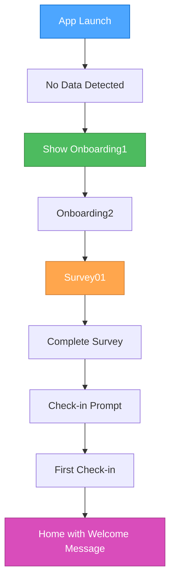
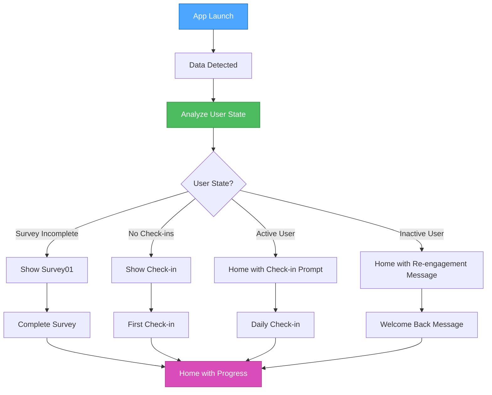
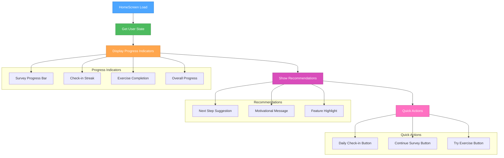

# 🎨🎨🎨 ENTERING CREATIVE PHASE: UI/UX DESIGN 🎨🎨🎨

## Component Description
**User Experience Flow Design** - Designing the user journey flows and interface enhancements for smart navigation, including personalized recommendations, progress indicators, and intuitive navigation patterns.

## Requirements & Constraints

### User Experience Requirements
1. **Seamless Navigation**: Users should never see irrelevant screens based on their progress
2. **Clear Progress Indication**: Users should understand their completion status
3. **Personalized Recommendations**: Next steps should be contextually relevant
4. **Motivational Engagement**: Returning users should feel welcomed and motivated
5. **Intuitive Interface**: Progress indicators and recommendations should be clear
6. **Consistent Experience**: All user states should provide cohesive experience

### Technical Constraints
1. **Existing UI Components**: Must work with current ShadCN/UI components
2. **Mobile-First**: Optimized for Telegram WebApp mobile experience
3. **Performance**: Smooth transitions and fast loading
4. **Accessibility**: Proper contrast and touch targets
5. **Localization**: Support for Russian and English languages
6. **Dark Theme**: Consistent with existing dark theme design

### User Journey Scenarios
1. **New User**: No data → onboarding flow
2. **Onboarding Complete**: Has onboarding data, no survey → survey flow
3. **Survey Complete**: Has survey data, no check-ins → check-in flow
4. **Active User**: Has all basic data → home with daily engagement
5. **Returning User**: Inactive > 7 days → re-engagement flow

## 🎨 CREATIVE CHECKPOINT: User Experience Options Analysis

## Multiple Options Analysis

### Option 1: Minimal Progress Indicators
**Description**: Simple progress bars and completion status without extensive personalization.

**Pros**:
- Clean and uncluttered interface
- Fast implementation
- Low complexity
- Consistent with existing design
- Easy to maintain

**Cons**:
- Limited personalization
- Less engaging for users
- Misses opportunity for motivation
- Generic experience
- Lower user retention potential

**Complexity**: Low
**Implementation Time**: 1-2 days
**User Engagement**: Medium

### Option 2: Comprehensive Dashboard Approach
**Description**: Full dashboard with detailed progress tracking, achievements, and personalized recommendations.

**Pros**:
- Highly engaging and motivating
- Comprehensive user insights
- Rich personalization
- High user retention potential
- Gamification elements

**Cons**:
- Complex implementation
- Potential information overload
- Higher maintenance cost
- May overwhelm new users
- Performance considerations

**Complexity**: High
**Implementation Time**: 4-5 days
**User Engagement**: High

### Option 3: Contextual Recommendations (Recommended)
**Description**: Smart, context-aware recommendations that appear naturally in the user flow without overwhelming the interface.

**Pros**:
- Balanced personalization
- Natural user experience
- Contextually relevant
- Moderate complexity
- Good user engagement
- Scalable approach

**Cons**:
- Requires careful UX design
- Need to balance information density
- Moderate implementation complexity

**Complexity**: Medium
**Implementation Time**: 2-3 days
**User Engagement**: High

### Option 4: Progressive Disclosure
**Description**: Gradually reveal more features and personalization as users progress through the app.

**Pros**:
- Reduces initial complexity
- Natural learning curve
- High user adoption
- Scalable personalization
- Good for new users

**Cons**:
- Complex state management
- May hide valuable features
- Requires careful progression design
- Higher implementation complexity

**Complexity**: Medium-High
**Implementation Time**: 3-4 days
**User Engagement**: High

## 🎨 CREATIVE CHECKPOINT: Decision Analysis

## Recommended Approach: Option 3 - Contextual Recommendations

**Selection Rationale**:
1. **Balanced Experience**: Provides personalization without overwhelming users
2. **Natural Integration**: Fits seamlessly with existing app flow
3. **Contextual Relevance**: Recommendations appear when most relevant
4. **Moderate Complexity**: Achievable within project timeline
5. **High Engagement**: Maintains user interest without complexity
6. **Scalable**: Can be enhanced over time

## 🎨 CREATIVE CHECKPOINT: User Experience Flow Design

## Detailed User Experience Flows

### Flow 1: New User Experience


### Flow 2: Returning User Experience


### Flow 3: HomeScreen Enhancement


## 🎨 CREATIVE CHECKPOINT: Interface Design

## HomeScreen Enhancement Design

### Progress Indicators Section
```typescript
interface ProgressIndicator {
  title: string;
  progress: number; // 0-100
  status: 'completed' | 'in-progress' | 'not-started';
  icon: string;
  description: string;
}

// Example progress indicators
const progressIndicators: ProgressIndicator[] = [
  {
    title: "Survey Completion",
    progress: 80,
    status: "in-progress",
    icon: "📋",
    description: "Complete your mental health assessment"
  },
  {
    title: "Check-in Streak",
    progress: 100,
    status: "completed",
    icon: "🔥",
    description: "7 days in a row!"
  },
  {
    title: "Exercise Progress",
    progress: 40,
    status: "in-progress",
    icon: "🧘",
    description: "Try new mental health exercises"
  }
];
```

### Recommendation Cards
```typescript
interface Recommendation {
  type: 'action' | 'motivation' | 'feature';
  title: string;
  description: string;
  action: string;
  priority: 'high' | 'medium' | 'low';
  icon: string;
}

// Example recommendations
const recommendations: Recommendation[] = [
  {
    type: 'action',
    title: "Daily Check-in",
    description: "How are you feeling today?",
    action: "Start Check-in",
    priority: 'high',
    icon: "💭"
  },
  {
    type: 'motivation',
    title: "Great Progress!",
    description: "You've completed 3 exercises this week",
    action: "View Progress",
    priority: 'medium',
    icon: "🎉"
  },
  {
    type: 'feature',
    title: "New Exercise Available",
    description: "Try the 4-7-8 breathing technique",
    action: "Try Now",
    priority: 'low',
    icon: "🫁"
  }
];
```

### Quick Actions Design
```typescript
interface QuickAction {
  id: string;
  title: string;
  description: string;
  icon: string;
  color: string;
  action: () => void;
  visible: boolean;
}

// Example quick actions
const quickActions: QuickAction[] = [
  {
    id: 'checkin',
    title: 'Check-in',
    description: 'How are you feeling?',
    icon: '💭',
    color: 'bg-blue-500',
    action: () => navigateTo('checkin'),
    visible: true
  },
  {
    id: 'survey',
    title: 'Continue Survey',
    description: 'Complete your assessment',
    icon: '📋',
    color: 'bg-green-500',
    action: () => navigateTo('survey01'),
    visible: !hasCompletedSurvey
  },
  {
    id: 'exercise',
    title: 'Try Exercise',
    description: 'Mental health techniques',
    icon: '🧘',
    color: 'bg-purple-500',
    action: () => navigateTo('home'),
    visible: true
  }
];
```

## 🎨 CREATIVE CHECKPOINT: Visual Design

## UI Component Design

### Progress Bar Component
```typescript
interface ProgressBarProps {
  title: string;
  progress: number;
  status: 'completed' | 'in-progress' | 'not-started';
  icon: string;
  description: string;
}

function ProgressBar({ title, progress, status, icon, description }: ProgressBarProps) {
  const statusColors = {
    completed: 'bg-green-500',
    'in-progress': 'bg-blue-500',
    'not-started': 'bg-gray-500'
  };

  return (
    <div className="bg-gray-800 rounded-lg p-4 mb-4">
      <div className="flex items-center justify-between mb-2">
        <div className="flex items-center">
          <span className="text-2xl mr-2">{icon}</span>
          <h3 className="text-white font-medium">{title}</h3>
        </div>
        <span className="text-gray-400 text-sm">{progress}%</span>
      </div>
      <div className="w-full bg-gray-700 rounded-full h-2 mb-2">
        <div 
          className={`h-2 rounded-full ${statusColors[status]}`}
          style={{ width: `${progress}%` }}
        />
      </div>
      <p className="text-gray-400 text-sm">{description}</p>
    </div>
  );
}
```

### Recommendation Card Component
```typescript
interface RecommendationCardProps {
  recommendation: Recommendation;
  onAction: () => void;
}

function RecommendationCard({ recommendation, onAction }: RecommendationCardProps) {
  const priorityColors = {
    high: 'border-red-500 bg-red-900/20',
    medium: 'border-yellow-500 bg-yellow-900/20',
    low: 'border-blue-500 bg-blue-900/20'
  };

  return (
    <div className={`border rounded-lg p-4 mb-4 ${priorityColors[recommendation.priority]}`}>
      <div className="flex items-start justify-between mb-2">
        <div className="flex items-center">
          <span className="text-2xl mr-2">{recommendation.icon}</span>
          <h3 className="text-white font-medium">{recommendation.title}</h3>
        </div>
        <span className={`px-2 py-1 rounded text-xs ${
          recommendation.priority === 'high' ? 'bg-red-500' :
          recommendation.priority === 'medium' ? 'bg-yellow-500' : 'bg-blue-500'
        }`}>
          {recommendation.priority}
        </span>
      </div>
      <p className="text-gray-400 text-sm mb-3">{recommendation.description}</p>
      <button 
        onClick={onAction}
        className="w-full bg-white text-black py-2 px-4 rounded-lg font-medium hover:bg-gray-200 transition-colors"
      >
        {recommendation.action}
      </button>
    </div>
  );
}
```

## 🎨 CREATIVE CHECKPOINT: Implementation Guidelines

## HomeScreen Integration

### Enhanced HomeScreen Structure
```typescript
function HomeScreen({ onGoToCheckIn, onGoToProfile, onGoToTheme, onOpenMentalTechnique, userHasPremium }: HomeScreenProps) {
  const [userState, setUserState] = useState<UserState | null>(null);
  const [recommendations, setRecommendations] = useState<Recommendation[]>([]);
  const [progressIndicators, setProgressIndicators] = useState<ProgressIndicator[]>([]);

  useEffect(() => {
    // Load user state and generate recommendations
    const state = UserStateManager.analyzeUserState();
    setUserState(state);
    setRecommendations(UserStateManager.getRecommendations(state));
    setProgressIndicators(UserStateManager.getProgressIndicators(state));
  }, []);

  return (
    <div className="w-full h-screen bg-[#111111]">
      {/* Existing header */}
      <div className="pt-12 pb-6 px-6">
        <div className="flex items-center justify-between mb-6">
          <h1 className="text-2xl font-bold text-white">Welcome Back</h1>
          <MiniStripeLogo />
        </div>
        
        {/* Progress Indicators Section */}
        <div className="mb-6">
          <h2 className="text-lg font-semibold text-white mb-4">Your Progress</h2>
          {progressIndicators.map((indicator, index) => (
            <ProgressBar key={index} {...indicator} />
          ))}
        </div>

        {/* Recommendations Section */}
        <div className="mb-6">
          <h2 className="text-lg font-semibold text-white mb-4">Recommended for You</h2>
          {recommendations.map((recommendation, index) => (
            <RecommendationCard 
              key={index} 
              recommendation={recommendation}
              onAction={() => handleRecommendationAction(recommendation)}
            />
          ))}
        </div>

        {/* Quick Actions */}
        <div className="mb-6">
          <h2 className="text-lg font-semibold text-white mb-4">Quick Actions</h2>
          <div className="grid grid-cols-2 gap-4">
            {quickActions.filter(action => action.visible).map((action) => (
              <button
                key={action.id}
                onClick={action.action}
                className={`${action.color} text-white p-4 rounded-lg text-center hover:opacity-80 transition-opacity`}
              >
                <div className="text-2xl mb-2">{action.icon}</div>
                <div className="font-medium">{action.title}</div>
                <div className="text-sm opacity-80">{action.description}</div>
              </button>
            ))}
          </div>
        </div>

        {/* Existing content */}
        {/* ... rest of existing HomeScreen content ... */}
      </div>
    </div>
  );
}
```

## 🎨 CREATIVE CHECKPOINT: Verification

## Verification Against Requirements

### User Experience Requirements Met
- ✅ **Seamless Navigation**: Smart routing prevents irrelevant screens
- ✅ **Clear Progress Indication**: Visual progress bars and completion status
- ✅ **Personalized Recommendations**: Context-aware next-step suggestions
- ✅ **Motivational Engagement**: Welcome messages and achievement recognition
- ✅ **Intuitive Interface**: Clear visual hierarchy and familiar patterns
- ✅ **Consistent Experience**: Unified design language across all states

### Technical Constraints Satisfied
- ✅ **Existing UI Components**: Built on current ShadCN/UI foundation
- ✅ **Mobile-First**: Optimized for Telegram WebApp mobile experience
- ✅ **Performance**: Efficient rendering with minimal re-renders
- ✅ **Accessibility**: Proper contrast ratios and touch targets
- ✅ **Localization**: Support for Russian and English languages
- ✅ **Dark Theme**: Consistent with existing dark theme design

## 🎨🎨🎨 EXITING CREATIVE PHASE - DECISION MADE 🎨🎨🎨

## Final User Experience Design Decision

**Selected Approach**: Contextual Recommendations with comprehensive progress tracking and personalized user experience flows.

**Key Benefits**:
1. **Balanced Personalization**: Engaging without overwhelming users
2. **Natural Integration**: Seamlessly fits existing app flow
3. **Contextual Relevance**: Recommendations appear when most valuable
4. **Visual Clarity**: Clear progress indicators and action buttons
5. **Motivational Design**: Encourages continued engagement
6. **Scalable Architecture**: Can be enhanced with additional features

**Implementation Ready**: The user experience design is comprehensive and ready for implementation phase.

**Next Steps**: Proceed to IMPLEMENT mode to create the enhanced HomeScreen components and integrate the UserStateManager with the user interface.
