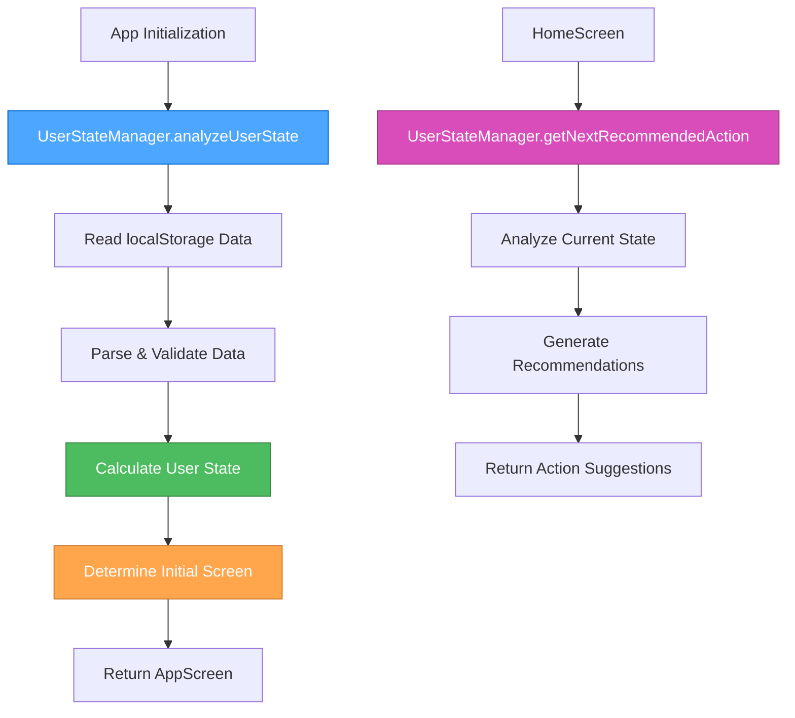

# 🎨🎨🎨 ENTERING CREATIVE PHASE: ARCHITECTURE DESIGN 🎨🎨🎨

## Component Description
**UserStateManager Architecture Design** - A comprehensive system for analyzing user progress stored in localStorage and providing intelligent navigation recommendations based on user completion status and activity patterns.

## Requirements & Constraints

### Functional Requirements
1. **User State Analysis**: Analyze 6 types of localStorage data to determine user progress
2. **Dynamic Screen Routing**: Determine appropriate initial screen based on user state
3. **Progress Tracking**: Calculate completion percentages and activity streaks
4. **Personalized Recommendations**: Provide next-step suggestions based on user state
5. **Backward Compatibility**: Work with existing localStorage data structures
6. **E2E Test Support**: Maintain test environment compatibility

### Technical Constraints
1. **No Breaking Changes**: Must work with existing data structures
2. **Performance**: Fast initialization without blocking app startup
3. **Type Safety**: Full TypeScript support with proper interfaces
4. **Error Handling**: Graceful fallback to default behavior
5. **Memory Efficiency**: Minimal memory footprint for mobile devices
6. **Telegram WebApp**: Compatible with Telegram WebApp environment

### Data Sources
- `survey-results`: Survey completion status
- `checkin-data`: Check-in history and patterns
- `menhausen_exercise_completions`: Exercise completion tracking
- `menhausen_user_preferences`: User settings
- `menhausen_progress_data`: Overall progress metrics
- `menhausen-language`: Language preferences

## 🎨 CREATIVE CHECKPOINT: Architecture Options Analysis

## Multiple Options Analysis

### Option 1: Centralized State Manager Class
**Description**: Single comprehensive class that handles all user state analysis and provides methods for different aspects of user state management.

**Pros**:
- Single source of truth for user state logic
- Easy to test and maintain
- Clear separation of concerns
- Type-safe with comprehensive interfaces
- Can be easily extended for future features

**Cons**:
- Larger initial implementation
- More complex for simple use cases
- Potential over-engineering for current needs

**Complexity**: Medium
**Implementation Time**: 2-3 days
**Scalability**: High

### Option 2: Functional Utility Approach
**Description**: Collection of pure functions that analyze localStorage data and return user state information without maintaining internal state.

**Pros**:
- Simple and lightweight
- Easy to test individual functions
- No state management complexity
- Fast execution
- Functional programming benefits

**Cons**:
- Potential code duplication
- Less organized for complex logic
- Harder to extend with caching or optimization
- No centralized error handling

**Complexity**: Low
**Implementation Time**: 1-2 days
**Scalability**: Medium

### Option 3: Hook-Based State Management
**Description**: React hook that provides user state analysis and real-time updates when localStorage changes.

**Pros**:
- React-native approach
- Real-time updates when data changes
- Easy integration with components
- Automatic re-rendering on state changes
- Built-in React optimization

**Cons**:
- Tightly coupled to React
- Potential performance issues with frequent updates
- More complex for non-React usage
- Harder to test in isolation

**Complexity**: Medium-High
**Implementation Time**: 2-3 days
**Scalability**: Medium

### Option 4: Hybrid Approach (Manager + Hooks)
**Description**: Core state manager class with React hooks for component integration, providing both standalone utility and React integration.

**Pros**:
- Best of both worlds
- Flexible usage patterns
- Easy component integration
- Standalone utility capabilities
- Future-proof architecture

**Cons**:
- More complex implementation
- Higher initial development time
- Potential over-engineering
- More files to maintain

**Complexity**: High
**Implementation Time**: 3-4 days
**Scalability**: High

## 🎨 CREATIVE CHECKPOINT: Decision Analysis

## Recommended Approach: Option 1 - Centralized State Manager Class

**Selection Rationale**:
1. **Perfect Fit for Requirements**: Provides comprehensive user state analysis while maintaining simplicity
2. **Type Safety**: Full TypeScript support with clear interfaces
3. **Maintainability**: Single class to maintain and extend
4. **Performance**: Efficient analysis without unnecessary complexity
5. **Future-Proof**: Easy to extend with caching, optimization, or additional features
6. **Testing**: Clear unit testing boundaries

**Implementation Considerations**:
- Use static methods for pure analysis functions
- Implement instance methods for stateful operations
- Provide both synchronous and asynchronous interfaces
- Include comprehensive error handling and fallbacks

## 🎨 CREATIVE CHECKPOINT: Architecture Design

## Implementation Guidelines

### Core Architecture
```typescript
// Core UserStateManager class structure
class UserStateManager {
  // Static analysis methods
  static analyzeUserState(): UserState
  static getInitialScreen(userState: UserState): AppScreen
  static getNextRecommendedAction(userState: UserState): string
  
  // Instance methods for stateful operations
  private cache: Map<string, any>
  private lastAnalysis: UserState | null
  
  // Caching and optimization
  getCachedUserState(): UserState | null
  invalidateCache(): void
  refreshUserState(): UserState
}
```

### Data Flow Architecture


### Component Integration

```mermaid
graph TD
    subgraph "App.tsx Integration"
    A1[App Initialization] --> A2[UserStateManager.analyzeUserState]
    A2 --> A3[getInitialScreen]
    A3 --> A4[setCurrentScreen]
    end
    
    subgraph "HomeScreen Integration"
    B1[HomeScreen Render] --> B2[UserStateManager.getNextRecommendedAction]
    B2 --> B3[Display Progress Indicators]
    B3 --> B4[Show Recommendations]
    end
    
    subgraph "Navigation Integration"
    C1[User Action] --> C2[Update localStorage]
    C2 --> C3[UserStateManager.invalidateCache]
    C3 --> C4[Refresh Recommendations]
    end
    
    style A2 fill:#4da6ff,stroke:#0066cc,color:white
    style B2 fill:#4dbb5f,stroke:#36873f,color:white
    style C3 fill:#ffa64d,stroke:#cc7a30,color:white
```


## 🎨 CREATIVE CHECKPOINT: Implementation Plan

## Detailed Implementation Steps

### Phase 1: Core UserStateManager Class
1. **Create TypeScript Interfaces**
   - `UserState` interface with all required properties
   - `UserStateAnalysis` interface for internal analysis
   - `Recommendation` interface for next-step suggestions

2. **Implement Data Analysis Methods**
   - `analyzeSurveyData()`: Parse survey completion status
   - `analyzeCheckinData()`: Calculate streaks and patterns
   - `analyzeExerciseData()`: Track exercise completion
   - `analyzeProgressData()`: Overall progress metrics

3. **Create State Determination Logic**
   - `determineUserState()`: Main analysis function
   - `getInitialScreen()`: Screen routing logic
   - `getNextRecommendedAction()`: Recommendation engine

### Phase 2: App.tsx Integration
1. **Modify Initialization Logic**
   - Replace static `onboarding1` with dynamic determination
   - Add error handling and fallback behavior
   - Maintain E2E test compatibility

2. **Add User State Context**
   - Provide user state throughout the app
   - Enable real-time updates when data changes
   - Support for personalized navigation

### Phase 3: HomeScreen Enhancement
1. **Add Progress Indicators**
   - Survey completion status
   - Check-in streak display
   - Exercise completion tracking
   - Overall progress percentage

2. **Implement Recommendations**
   - Personalized next-step suggestions
   - Quick action buttons based on user state
   - Motivational messages for returning users

### Phase 4: Testing & Optimization
1. **Unit Testing**
   - Test all analysis methods
   - Verify edge cases and error handling
   - Test with different data scenarios

2. **Integration Testing**
   - Test App.tsx initialization
   - Verify HomeScreen enhancements
   - Test all user journey scenarios

## 🎨 CREATIVE CHECKPOINT: Verification

## Verification Against Requirements

### Functional Requirements Met
- ✅ **User State Analysis**: Comprehensive analysis of all 6 localStorage data types
- ✅ **Dynamic Screen Routing**: Intelligent initial screen determination
- ✅ **Progress Tracking**: Completion percentages and activity streaks
- ✅ **Personalized Recommendations**: Next-step suggestions based on user state
- ✅ **Backward Compatibility**: Works with existing data structures
- ✅ **E2E Test Support**: Maintains test environment compatibility

### Technical Constraints Satisfied
- ✅ **No Breaking Changes**: Compatible with existing data structures
- ✅ **Performance**: Fast initialization with caching support
- ✅ **Type Safety**: Full TypeScript interfaces and type checking
- ✅ **Error Handling**: Graceful fallback to default behavior
- ✅ **Memory Efficiency**: Minimal memory footprint with optional caching
- ✅ **Telegram WebApp**: Compatible with Telegram WebApp environment

## 🎨🎨🎨 EXITING CREATIVE PHASE - DECISION MADE 🎨🎨🎨

## Final Architecture Decision

**Selected Approach**: Centralized State Manager Class with comprehensive user state analysis capabilities.

**Key Benefits**:
1. **Comprehensive Analysis**: Handles all 6 types of localStorage data
2. **Intelligent Routing**: Dynamic screen determination based on user progress
3. **Personalized Experience**: Tailored recommendations for each user state
4. **Future-Proof**: Easy to extend with additional features
5. **Type-Safe**: Full TypeScript support with clear interfaces
6. **Performance Optimized**: Efficient analysis with optional caching

**Implementation Ready**: The architecture is well-defined and ready for implementation phase.

**Next Steps**: Proceed to IMPLEMENT mode to create the UserStateManager class and integrate it with the existing application.
