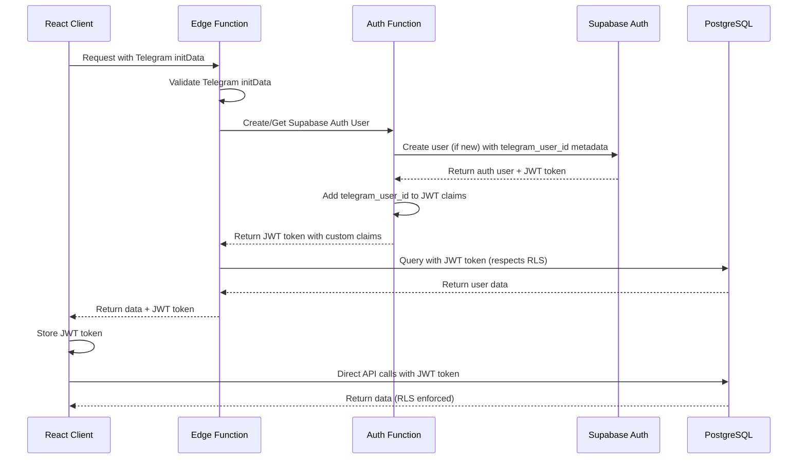

# Supabase Auth Integration Plan

**Date**: 2026-01-09  
**Status**: Planning  
**Priority**: High

---

## Overview

Integrate Supabase's built-in authentication system with the existing Telegram authentication flow. After validating Telegram initData, create users in Supabase Auth, generate JWT tokens with custom claims, and use these tokens for all API requests. This will enable proper Row Level Security (RLS) policies and follow Supabase best practices.

## Architecture Flow



## Implementation Steps

### Phase 1: Database Schema Updates

#### 1.1 Create Auth Users Link Table
**File**: `supabase/migrations/[timestamp]_link_auth_users.sql`

- Create `auth_user_mapping` table to link `auth.users.id` (UUID) with `telegram_user_id` (BIGINT)
- Add foreign key constraints
- Create indexes for performance

```sql
CREATE TABLE IF NOT EXISTS auth_user_mapping (
  auth_user_id UUID PRIMARY KEY REFERENCES auth.users(id) ON DELETE CASCADE,
  telegram_user_id BIGINT UNIQUE NOT NULL REFERENCES users(telegram_user_id) ON DELETE CASCADE,
  created_at TIMESTAMPTZ DEFAULT NOW(),
  updated_at TIMESTAMPTZ DEFAULT NOW()
);

CREATE INDEX idx_auth_user_mapping_telegram_id ON auth_user_mapping(telegram_user_id);
```

#### 1.2 Enable RLS on All Tables
**File**: `supabase/migrations/[timestamp]_enable_rls.sql`

- Enable RLS on all existing tables
- Create helper function to get `telegram_user_id` from JWT claims
- Create RLS policies for SELECT, INSERT, UPDATE, DELETE operations

```sql
-- Helper function to extract telegram_user_id from JWT
CREATE OR REPLACE FUNCTION get_telegram_user_id_from_jwt()
RETURNS BIGINT AS $$
  SELECT (auth.jwt() -> 'user_metadata' ->> 'telegram_user_id')::BIGINT;
$$ LANGUAGE SQL STABLE;

-- Enable RLS on all tables
ALTER TABLE users ENABLE ROW LEVEL SECURITY;
ALTER TABLE survey_results ENABLE ROW LEVEL SECURITY;
ALTER TABLE daily_checkins ENABLE ROW LEVEL SECURITY;
-- ... (all other tables)

-- Example policy for daily_checkins
CREATE POLICY "Users can view own checkins"
ON daily_checkins FOR SELECT
TO authenticated
USING (telegram_user_id = get_telegram_user_id_from_jwt());

CREATE POLICY "Users can insert own checkins"
ON daily_checkins FOR INSERT
TO authenticated
WITH CHECK (telegram_user_id = get_telegram_user_id_from_jwt());
-- ... (similar policies for all tables)
```

### Phase 2: Auth Edge Function

#### 2.1 Create Auth Function
**File**: `supabase/functions/auth-telegram/index.ts`

- Validate Telegram initData
- Check if Supabase Auth user exists (via `auth_user_mapping`)
- Create new auth user if doesn't exist using `supabase.auth.admin.createUser()`
- Generate JWT token with custom claims (telegram_user_id)
- Return JWT token to client

Key implementation:
- Use Service Role Key only in this function (for admin operations)
- Store `telegram_user_id` in `user_metadata` when creating user
- Use Supabase JWT secret to sign custom tokens with `telegram_user_id` claim
- Link auth user to `telegram_user_id` in `auth_user_mapping` table

### Phase 3: Update Existing Edge Functions

#### 3.1 Update get-user-data Function
**File**: `supabase/functions/get-user-data/index.ts`

- Accept JWT token in `Authorization` header instead of Telegram initData
- Validate JWT token using Supabase client
- Extract `telegram_user_id` from JWT claims
- Use Anon Key + JWT token instead of Service Role Key
- Remove direct Telegram validation (moved to auth function)

#### 3.2 Update sync-user-data Function
**File**: `supabase/functions/sync-user-data/index.ts`

- Accept JWT token in `Authorization` header
- Validate JWT token
- Extract `telegram_user_id` from JWT claims
- Use Anon Key + JWT token instead of Service Role Key
- Remove direct Telegram validation

### Phase 4: Client-Side Updates

#### 4.1 Create Auth Service
**File**: `utils/supabaseSync/authService.ts`

- Function to authenticate with Telegram and get JWT token
- Function to refresh JWT token
- Function to store/retrieve JWT token from localStorage
- Function to check if JWT token is expired

#### 4.2 Update Supabase Client Initialization
**File**: `utils/supabaseSync/supabaseSyncService.ts`

- Update `initializeSupabase()` to accept JWT token
- Use `supabase.auth.setSession()` or `accessToken` option when creating client
- Add method to refresh JWT token before API calls
- Handle token expiration and auto-refresh

#### 4.3 Update API Calls
**File**: `utils/supabaseSync/supabaseSyncService.ts`

- Update `fetchFromSupabase()` to include JWT token in Authorization header
- Update `syncToSupabase()` to include JWT token
- Update `fastSyncCriticalData()` to use JWT token
- Add token refresh logic before each API call

### Phase 5: Migration Strategy

#### 5.1 Data Migration Script
**File**: `supabase/migrations/[timestamp]_migrate_existing_users.sql`

- For existing users in `users` table, create corresponding Supabase Auth users
- Generate JWT tokens for existing users
- Populate `auth_user_mapping` table

#### 5.2 Backward Compatibility
- Keep Telegram validation in Edge Functions during transition
- Support both JWT token and Telegram initData headers (deprecate initData gradually)
- Add feature flag to switch between old and new auth methods

## Key Files to Modify

### New Files
- `supabase/migrations/[timestamp]_link_auth_users.sql` - Auth user mapping table
- `supabase/migrations/[timestamp]_enable_rls.sql` - RLS policies
- `supabase/migrations/[timestamp]_migrate_existing_users.sql` - Data migration
- `supabase/functions/auth-telegram/index.ts` - Auth function
- `utils/supabaseSync/authService.ts` - Client auth service

### Modified Files
- `supabase/functions/get-user-data/index.ts` - Use JWT tokens
- `supabase/functions/sync-user-data/index.ts` - Use JWT tokens
- `utils/supabaseSync/supabaseSyncService.ts` - JWT token handling
- `supabase/functions/_shared/telegram-auth.ts` - Keep for validation, add JWT generation

## Environment Variables

### Edge Functions
- `SUPABASE_URL` - Already exists
- `SUPABASE_SERVICE_ROLE_KEY` - Already exists (only for auth function)
- `SUPABASE_JWT_SECRET` - New: JWT secret for signing custom tokens
- `TELEGRAM_BOT_TOKEN` - Already exists

### Client
- `VITE_SUPABASE_URL` - Already exists
- `VITE_SUPABASE_ANON_KEY` - Already exists
- No new variables needed

## Security Considerations

1. **Service Role Key**: Only use in `auth-telegram` function for creating users. Never expose to client.
2. **JWT Tokens**: Store in localStorage with expiration handling
3. **RLS Policies**: All tables must have proper policies before enabling RLS
4. **Token Refresh**: Implement automatic token refresh before expiration
5. **Token Validation**: Always validate JWT tokens on server side

## Testing Strategy

1. **Unit Tests**: Test JWT token generation and validation
2. **Integration Tests**: Test auth flow end-to-end
3. **RLS Tests**: Verify RLS policies work correctly
4. **Migration Tests**: Test existing user migration
5. **Backward Compatibility**: Test both auth methods during transition

## Rollout Plan

1. **Phase 1**: Deploy database migrations (non-breaking)
2. **Phase 2**: Deploy auth function (new endpoint, doesn't affect existing)
3. **Phase 3**: Update client to use new auth flow (feature flag)
4. **Phase 4**: Update Edge Functions to accept JWT tokens (backward compatible)
5. **Phase 5**: Enable RLS policies (test thoroughly first)
6. **Phase 6**: Remove old Telegram initData support (after verification)

## Success Criteria

- All API requests use JWT tokens
- RLS policies enforce data isolation
- Service Role Key only used in auth function
- Existing users migrated successfully
- No breaking changes for end users
- Performance maintained or improved

## Task List

### Database Tasks
- [ ] Create `auth_user_mapping` table migration
- [ ] Create RLS policies migration (enable RLS on all tables)
- [ ] Create helper function `get_telegram_user_id_from_jwt()`
- [ ] Create RLS policies for all tables (SELECT, INSERT, UPDATE, DELETE)
- [ ] Create migration script for existing users

### Backend Tasks
- [ ] Create `auth-telegram` Edge Function
- [ ] Update `get-user-data` Edge Function to use JWT tokens
- [ ] Update `sync-user-data` Edge Function to use JWT tokens
- [ ] Add JWT token validation utilities

### Frontend Tasks
- [ ] Create `authService.ts` for JWT token management
- [ ] Update `SupabaseSyncService` to use JWT tokens
- [ ] Add token refresh logic
- [ ] Update all API calls to include JWT tokens

### Testing Tasks
- [ ] Test JWT token generation and validation
- [ ] Test RLS policies enforcement
- [ ] Test end-to-end auth flow
- [ ] Test existing user migration
- [ ] Test backward compatibility

### Deployment Tasks
- [ ] Deploy database migrations
- [ ] Deploy auth function
- [ ] Deploy updated Edge Functions
- [ ] Enable RLS policies
- [ ] Monitor and verify

---

**Last Updated**: 2025-01-25
